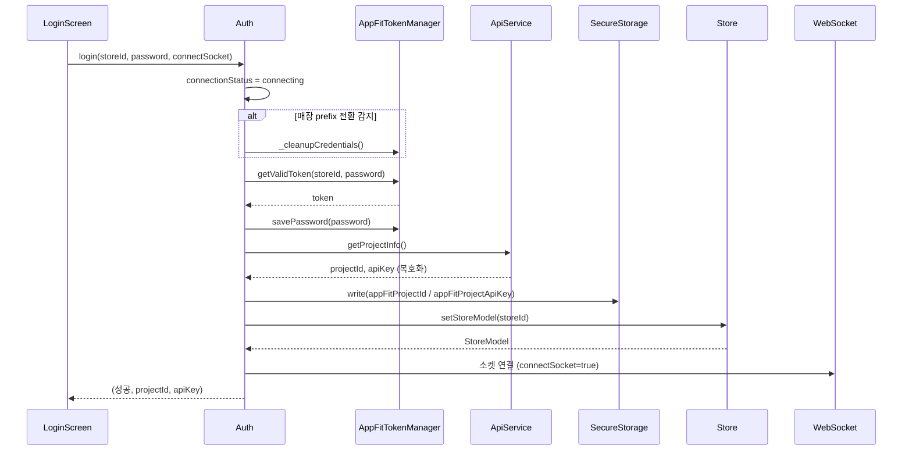
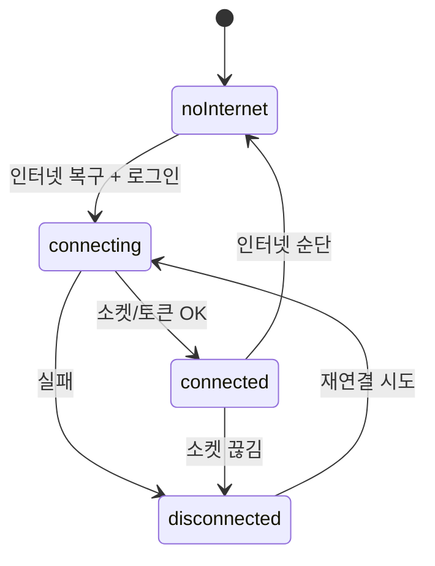
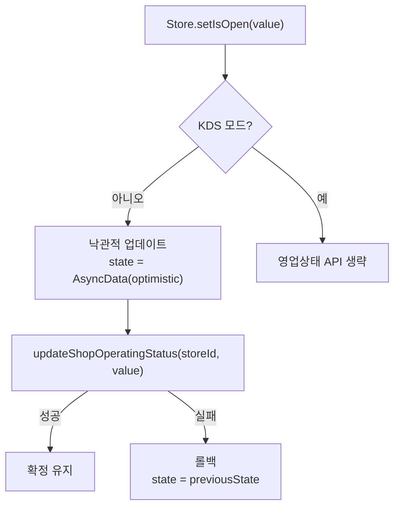
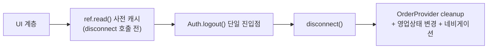
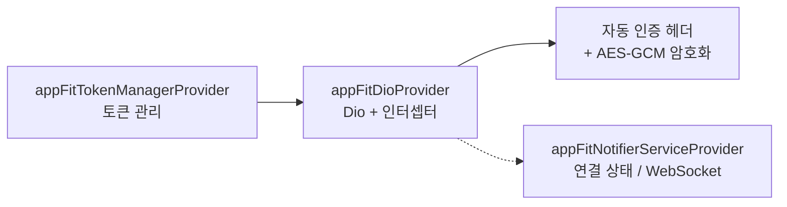

# 인증/세션 흐름 (Auth & Session Flow)

로그인부터 매장 정보 로드·영업상태 토글·로그아웃 정리까지의 세션 생명주기를 도식화한 문서다.
인증 토큰·암호화는 `appfit_core`의 `AppFitTokenManager`/Dio 인터셉터가 담당하고,
앱은 그 위에서 매장 전환·영업상태·세션 정리를 조율한다.

> 한 줄 요약: **login → 매장 전환 감지·정리 → 토큰 획득 → SecureStorage 저장 → 매장 정보 로드 → 소켓 연결**.
> 모든 REST 호출은 `appFitDioProvider`(자동 인증 헤더 + AES-GCM)를 경유한다. 직접 http/Dio 금지(CLAUDE.md).

---

## 1. 로그인 시퀀스

- 진입 시 `ConnectionStatus.connecting`으로 전환.
- **매장 전환 감지**: 저장된 매장 prefix와 입력 storeId가 다르면 이전 자격증명을 정리(`_cleanupCredentials`)해 교차 오염 방지.
- 토큰 획득 후 `getProjectInfo`로 받은 projectId/apiKey를 `SecureStorage`에 저장(`appFitProjectId`, `appFitProjectApiKey`).
- `login` 반환형: `(bool 성공, String? projectId, String? apiKey)`.

---

## 2. 연결 상태

- `ConnectionStatus` = `noInternet` / `disconnected` / `connecting` / `connected` ([auth_provider.dart](../lib/providers/auth_provider.dart)).
- `AuthState` 필드: `hasInternet`, `errorMessage`, `connectionStatus`. `appFitNotifierServiceProvider`로 AppFit 연결 상태를 감시.

---

## 3. 영업상태 토글 (낙관적 업데이트)

- `Store`는 `AsyncNotifier<StoreModel?>`. UI 응답성을 위해 먼저 낙관적으로 상태를 바꾸고, API 실패 시 이전 상태로 롤백.
- KDS 모드에서는 영업상태 변경 API를 호출하지 않음.

---

## 4. 로그아웃·세션 정리 규칙

> ⚠️ **절대 규칙**(CLAUDE.md): 인증/세션 정리는 `Auth.logout()` 단일 진입점만 사용. `disconnect()` 호출 후에는
> dependency가 outdated되므로 **모든 `ref.read()`는 disconnect 전에 미리 캐시**해야 한다. UI 계층은
> `Auth.logout()` 호출 + 영업상태 변경 + `OrderProvider` cleanup + 네비게이션만 담당.

---

## 5. 토큰/Dio 계층 (appfit_core 통합)

- 모든 REST 호출은 `appFitDioProvider`의 인터셉터를 경유 — 직접 http/Dio 사용 금지.
- `appfit_core`는 별도 git 레포(태그 ref 핀)이며, 수정 시 태그+푸시+ref 범프까지 필요(메모리 `appfit_core_dual_repo`).

---

## 6. 핵심 파일 색인

| 파일 | 역할 |
| --- | --- |
| [auth_provider.dart](../lib/providers/auth_provider.dart) | `Auth`, `login`, `logout`, `ConnectionStatus`, `AuthState` |
| [store_provider.dart](../lib/providers/store_provider.dart) | `Store`(AsyncNotifier), `setStoreModel`, `setIsOpen` 낙관적/롤백 |
| [appfit_providers.dart](../lib/services/appfit/appfit_providers.dart) | `appFitTokenManagerProvider`, `appFitDioProvider`, `appFitNotifierServiceProvider` |
| [secure_storage_service.dart](../lib/services/secure_storage_service.dart) | `appFitProjectId`/`appFitProjectApiKey` 보안 저장 |
