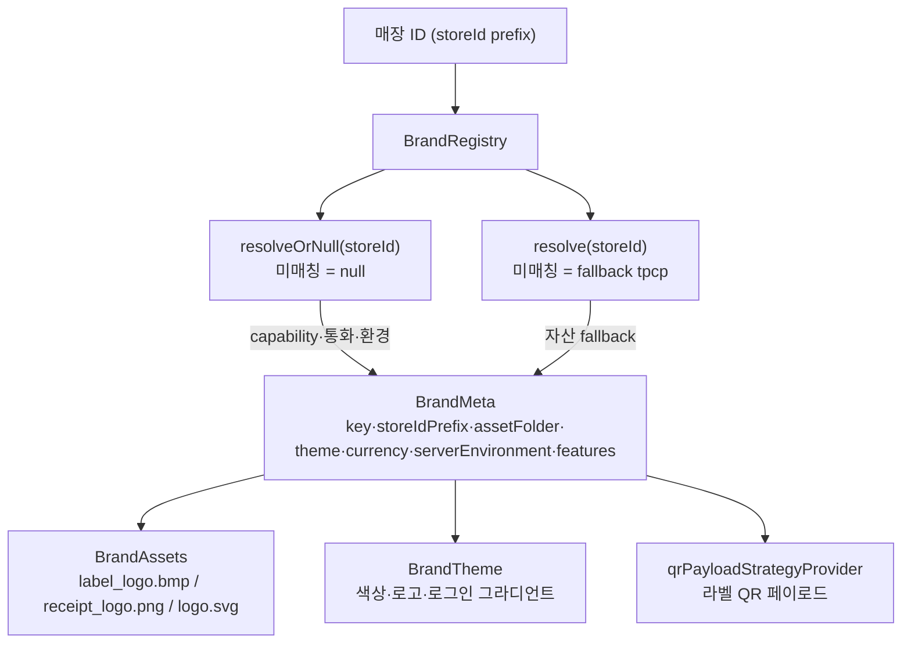
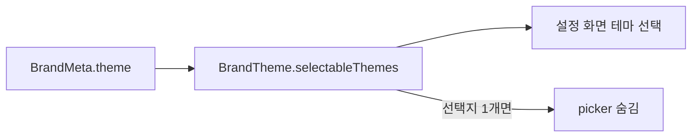
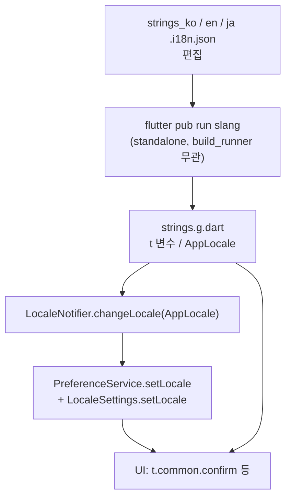

# 브랜드 / i18n 흐름 (Brand & i18n Flow)

멀티 브랜드 자원 분기와 다국어(slang) 파이프라인의 **시각적 흐름**만 담은 문서다.
자산 변환(PNG→BMP)·BMP 사양·새 브랜드 추가 **절차**는 [docs/BRAND_ASSETS.md](BRAND_ASSETS.md)에,
빌드/i18n 명령어는 [docs/BUILD.md](BUILD.md)에 있으므로 여기서는 도식과 연결고리에 집중한다.

> 한 줄 요약: **매장 ID → BrandRegistry → BrandMeta → (자산 / 테마 / QR 전략)**, **JSON → slang → strings.g.dart → LocaleNotifier → UI**.

---

## 1. 브랜드 해석 흐름

- **2단 해석** ([brand_registry.dart](../lib/utils/brand_registry.dart)): capability/통화/환경은 `resolveOrNull`(null 안전, 미지의 매장 = 브랜드 미적용), 자산은 `resolve`(fallback `BrandKey.tpcp`)로 항상 그릴 것을 보장.
- **BrandKey**: `tpcp`(tokyoplatz·fallback) / `mhst`(mammoth) / `mata`(mahataste) / `paik`.
- `currentBrandProvider`는 `PreferenceService`의 매장 ID → `resolveOrNull` → `BrandMeta?`(미로그인/미지의 매장은 null).

**자산 경로 규칙** (`BrandMeta`의 getter, 기준 `assets/images/brand/<folder>/`)

| 자산 | getter | 사양 | 필수 |
| --- | --- | --- | --- |
| 라벨 로고 | `labelLogoPath` | `label_logo.bmp` (50×50, 1-bit) | 필수 |
| 영수증 로고 | `receiptLogoPath` | `receipt_logo.png` (`hasReceiptLogo` true일 때만) | 선택 |
| 테마 로고 | `themeLogoPath` | `logo.svg` | 선택 |

- `BrandAssets`는 매 호출마다 매장 ID를 재해석해 경로를 반환하므로, 출력부가 경로 비교로 lazy 재로드(별도 hook 불필요). 자세한 사양은 [docs/BRAND_ASSETS.md](BRAND_ASSETS.md).
- **QR 전략**: `qrPayloadStrategyProvider`가 `currentBrandProvider`의 `BrandKey`로 switch(모든 케이스 명시 → 새 브랜드 추가 시 analyzer가 강제). 현재 전 브랜드 `DefaultQrPayloadStrategy` = `{OrderNo}-{ShopItemId}-{CupIdx}`.

---

## 2. 테마 분기

- `BrandTheme` = `appfitDefault` / `mammothCoffee` / `mata` / `paik` ([brand_theme.dart](../lib/constants/brand_theme.dart)).
- `selectableThemes`는 기본 테마(`appfitDefault`) + 브랜드 고유 테마만 노출. 고유 테마가 없으면 1개만 → 선택 UI 숨김.

---

## 3. i18n 파이프라인

- **base_locale `ko`**, fallback_strategy `base_locale`, `translate_var: t` ([slang.yaml](../slang.yaml)). `AppLocale` = `ko`(base)/`en`/`ja`.
- slang은 standalone(`slang_build_runner` 미사용)이라 **build_runner로는 `strings.g.dart`가 갱신되지 않음** → JSON 편집 후 `flutter pub run slang` 필수(메모리 `slang_regen_command`).
- 런타임 언어 전환은 `LocaleNotifier.changeLocale`([locale_provider.dart](../lib/providers/locale_provider.dart))가 `PreferenceService` 영속화 + `LocaleSettings` 동기화.

---

## 4. 확장점 (어디를 건드리나)

| 작업 | 건드릴 지점 | 절차 문서 |
| --- | --- | --- |
| 새 브랜드 | `BrandKey` enum + `BrandRegistry` 등록 + `BrandTheme`(선택) + 자산 배치 + `pubspec.yaml` + `qrPayloadStrategyProvider` | [BRAND_ASSETS.md](BRAND_ASSETS.md) / `/add-brand` 스킬 |
| 새 언어 | `slang.yaml` 로캘 추가 + `strings_<locale>.i18n.json` + `flutter pub run slang` | [BUILD.md](BUILD.md) / `/i18n` 스킬 |
| 새 QR 포맷 | `qrPayloadStrategyProvider` switch에 전략 추가 | — |

---

## 5. 핵심 파일 색인

| 파일 | 역할 |
| --- | --- |
| [brand_registry.dart](../lib/utils/brand_registry.dart) | `BrandKey`·`BrandMeta`·`resolve/resolveOrNull`·fallback(SSOT) |
| [brand_theme.dart](../lib/constants/brand_theme.dart) | `BrandTheme` enum·`selectableThemes` |
| [brand_provider.dart](../lib/providers/brand_provider.dart) | `currentBrandProvider` |
| [brand_assets.dart](../lib/utils/brand_assets.dart) | 자산 경로 파사드(매 호출 재해석) |
| [qr_payload_strategy.dart](../lib/services/label_printer/qr_payload_strategy.dart) | 라벨 QR 페이로드 브랜드 전략 |
| [locale_provider.dart](../lib/providers/locale_provider.dart) | `LocaleNotifier.changeLocale` |
| [slang.yaml](../slang.yaml) | slang 설정(base ko, fallback) |
| [strings.g.dart](../lib/i18n/strings.g.dart) | 생성된 번역(`t`·`AppLocale`) |
