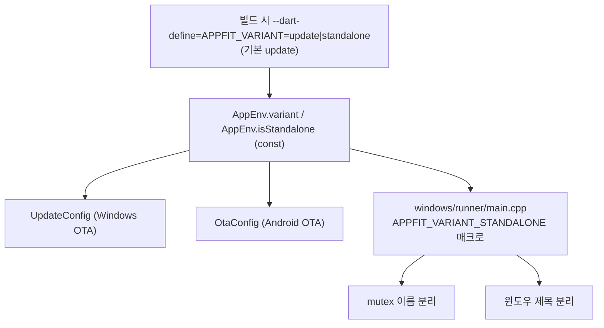
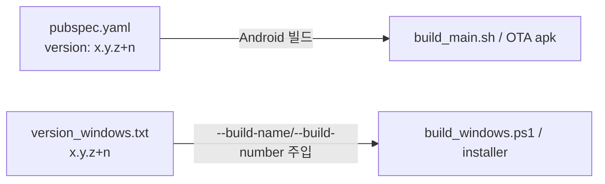

# 빌드 변형 흐름 (Build Variants Flow)

`update` / `standalone` 두 변형이 하나의 코드베이스에서 어떻게 분기되는지의 **시각적 흐름**만 담은 문서다.
빌드/배포 **명령어·환경설정·인스톨러**는 [docs/BUILD.md](BUILD.md)에 있으므로 여기서는 분기 구조와 채널 분리에 집중한다.

> 한 줄 요약: **`--dart-define=APPFIT_VARIANT` → `AppEnv.isStandalone` → (UpdateConfig·OtaConfig 채널 분기 + Windows mutex/제목 분리)**.
> 두 변형은 exe명·OTA URL·mutex가 모두 분리되어 **동일 머신에서 병존 설치/실행** 가능.

---

## 1. 변형 분기

- `AppEnv.variant`는 `String.fromEnvironment('APPFIT_VARIANT', defaultValue: 'update')`, `isStandalone = variant == 'standalone'` ([app_env.dart](../lib/config/app_env.dart)). 둘 다 **const**여야 함(getter 불가 — 메모리 `app_env_gitignored_variant`).
- Windows 네이티브는 CMake `APPFIT_WINDOWS_VARIANT` 환경변수 → `APPFIT_VARIANT_STANDALONE` 매크로로 mutex/제목을 컴파일 타임 분리.

---

## 2. update vs standalone 비교

| 항목 | update | standalone |
| --- | --- | --- |
| 목표 | 구앱 업그레이드 | 신규 병존 설치 |
| Windows exe | `appfit_order_agent.exe` | `appfit_order_agent_standalone.exe` |
| Windows version json | `appfit_order_agent_windows_version.json` | `appfit_order_agent_standalone_windows_version.json` |
| Windows zip | `appfit_order_agent_windows.zip` | `appfit_order_agent_standalone_windows.zip` |
| Android version json | `appfit_order_agent_version.json` | `appfit_order_agent_standalone_version.json` |
| Android apk | `appfit_order_agent.apk` | `appfit_order_agent_standalone.apk` |
| Windows mutex | `...AppfitOrderAgent_SingleInstance_Mutex` | `...AppfitOrderAgentStandalone_SingleInstance_Mutex` |
| 임시 작업 dir | `appfit_order_agent_update_extracted` | `appfit_order_agent_standalone_update_extracted` |

- 공통 OTA base URL: `http://waldpay.kokonutstamp2.com/`. 타임아웃: connect 15s / check 10s / download 10m ([update_config.dart](../lib/config/update_config.dart), [ota_config.dart](../lib/config/ota_config.dart)).
- 채널 파일명/exe명/임시 파일이 전부 분리되어 동시 업데이트·실행 충돌을 방지.
- standalone은 **신규 설치**라 기존 설정을 승계하지 않으며(마이그레이션 미구현), Inno Setup GUID도 영구 분리(메모리 `dual_variant_build`).

---

## 3. 버전 정본 이원화

- **Android 버전 정본 = `pubspec.yaml`**, **Windows 버전 정본 = `version_windows.txt`**. 둘은 분리(Windows 빌드 스크립트는 pubspec을 읽지 않음).
- `build_windows.ps1`/`deploy_windows.ps1`/`build_installer.ps1`이 `version_windows.txt`에서 build-name/number를 읽어 주입(CLAUDE.md 절대 규칙). 빌드 명령은 [docs/BUILD.md](BUILD.md).

---

## 4. 핵심 파일 색인

| 파일 | 역할 |
| --- | --- |
| [app_env.dart](../lib/config/app_env.dart) | `variant`/`isStandalone`(const, `APPFIT_VARIANT`) |
| [update_config.dart](../lib/config/update_config.dart) | Windows OTA 채널 파일명·타임아웃 분기 |
| [ota_config.dart](../lib/config/ota_config.dart) | Android OTA 채널 파일명 분기 |
| [windows/runner/main.cpp](../windows/runner/main.cpp) | `APPFIT_VARIANT_STANDALONE` 매크로·mutex/제목 분리 |
| [version_windows.txt](../version_windows.txt) | Windows 버전 정본 |
| [pubspec.yaml](../pubspec.yaml) | Android 버전 정본 |
