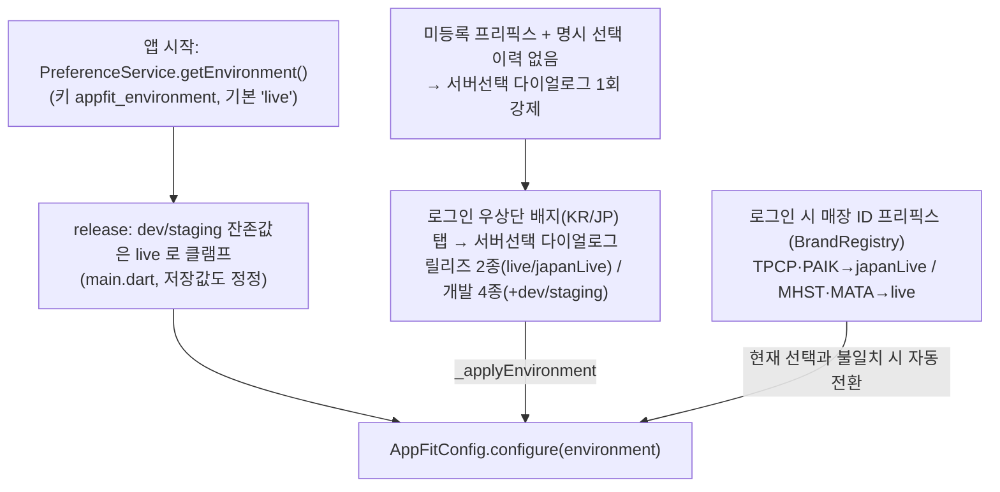
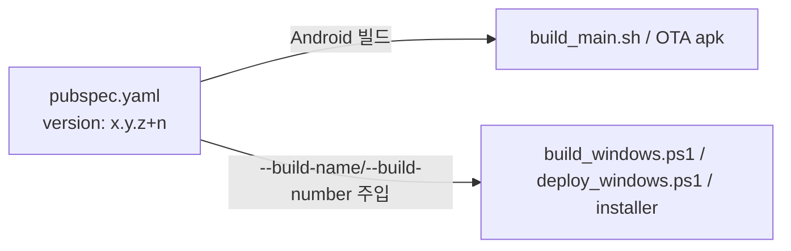

# 단일 빌드 모델 (Single Build Flow)

단일 빌드가 한국/일본을 어떻게 모두 서빙하는지의 **시각적 흐름**만 담은 문서다.
빌드/배포 **명령어·환경설정·인스톨러**는 [docs/BUILD.md](BUILD.md)에 있으므로 여기서는 서버 결정 구조와 OTA 채널에 집중한다.

> 한 줄 요약: **단일 패키지·단일 exe·단일 빌드**. 빌드 변형(`APPFIT_VARIANT` dart-define)은
> 제거됐고, 서버(live/japanLive)는 **런타임**에 결정된다 — 저장값(기본 live) +
> 로그인 화면 서버선택 배지 + 매장 ID 프리픽스 자동 전환.
> applicationId·Windows exe명·mutex·설치 GUID는 국가와 무관하게 하나로 통일되어, **머신당 하나만 설치/실행**된다.

---

## 1. 서버 결정 (런타임)

- 저장 키: `appfit_environment`(기본 `live`), 명시 선택 이력: `appfit_environment_manual_override`(배지/다이얼로그에서 선택 시 기록 — 미등록 프리픽스의 1회 다이얼로그 재출현 방지).
- 전환 시퀀스([login_screen.dart](../lib/screens/login_screen.dart) `_applyEnvironment`): WebSocket 해제 → 환경 저장 → `AppFitConfig.configure` → 토큰/자격증명 정리 → tokenManager/dio invalidate. `appFitNotifierServiceProvider` 는 invalidate 금지(`late final` — disconnect 만). 순서 변경 금지(서버 전환 후 재로그인 크래시 방어).
- 프리픽스 자동 전환은 **live/japanLive 세션에서만** 동작한다(개발 빌드의 dev/staging 테스트 보호).

---

## 2. 산출물과 OTA 채널

| 플랫폼 | 산출물 | OTA 채널 (version JSON / 파일) |
| --- | --- | --- |
| Android | `app-release.apk` (패키지 `co.kr.waldlust.order.receive.appfit`) | `appfit_order_agent_release_version.json` / `appfit_order_agent_release.apk` |
| Windows | `appfit_order_agent.exe` (Release 폴더 ZIP) | `appfit_order_agent_windows_version.json` / `appfit_order_agent_windows.zip` (레거시 무접미 계속 사용) |

- 공통 OTA base URL: `http://waldpay.kokonutstamp2.com/`. 타임아웃: connect 15s / check 10s / download 10m ([update_config.dart](../lib/config/update_config.dart), [ota_config.dart](../lib/config/ota_config.dart)).
- **Android 레거시 채널 동결(FROZEN)**: 무접미 `appfit_order_agent.apk` / `appfit_order_agent_version.json` 은 구 패키지(`co.kr.waldlust.order.receive`)로 설치된 일본 매장 1곳 전용이라 **업로드 금지**(신규 패키지로 수동 재설치 시까지). 구 `_japan`/`_korea`/`_appfit` 채널은 폐기(미사용).
- **Windows 는 레거시 채널이 곧 단일 채널(동결 아님)**: 패키지 개념이 없고 exe명이 동일해 기존 설치본이 자연 업데이트된다. Android 와 정책이 반대이니 주의.
- 채널이 플랫폼당 하나이므로 업로드 즉시 **한국/일본 동시 롤아웃**된다(지역별 시차 배포 불가).

---

## 3. 버전 정본 단일화

- **Android·Windows 버전 정본 = `pubspec.yaml`의 `version`** 하나다. 과거의 `version_windows.txt`는 폐지됐다.
- Windows 스크립트(`build_windows.ps1`/`deploy_windows.ps1`/`build_installer.ps1`/`archive_windows.ps1`)가 `pubspec.yaml`에서 build-name/number를 읽어 주입(CLAUDE.md 절대 규칙). 빌드 명령은 [docs/BUILD.md](BUILD.md).
- 버전 번호가 두 플랫폼 공유이므로, 한쪽만 배포해도 다음 배포의 빌드번호는 함께 증가한다(OTA는 플랫폼별 채널 JSON 기준이라 문제 없음).

---

## 4. 핵심 파일 색인

| 파일 | 역할 |
| --- | --- |
| [main.dart](../lib/main.dart) | 시작 시 저장 환경 로드 + release 클램프 |
| [login_screen.dart](../lib/screens/login_screen.dart) | 서버 배지·선택 다이얼로그·`_applyEnvironment`·프리픽스 자동 전환 |
| [brand_registry.dart](../lib/utils/brand_registry.dart) | 브랜드별 `serverEnvironment` SSOT |
| [ota_config.dart](../lib/config/ota_config.dart) | Android OTA 채널(`_release`) + 레거시 동결 경고 |
| [update_config.dart](../lib/config/update_config.dart) | Windows OTA 채널(레거시 무접미) |
| [windows/runner/main.cpp](../windows/runner/main.cpp) | 단일 mutex/제목 |
| [pubspec.yaml](../pubspec.yaml) | Android·Windows 공통 버전 정본 |
