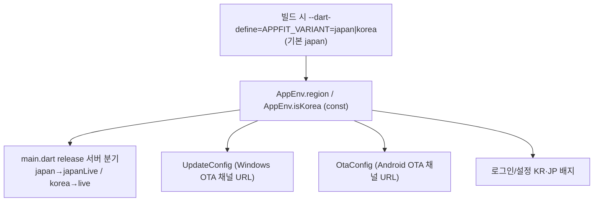
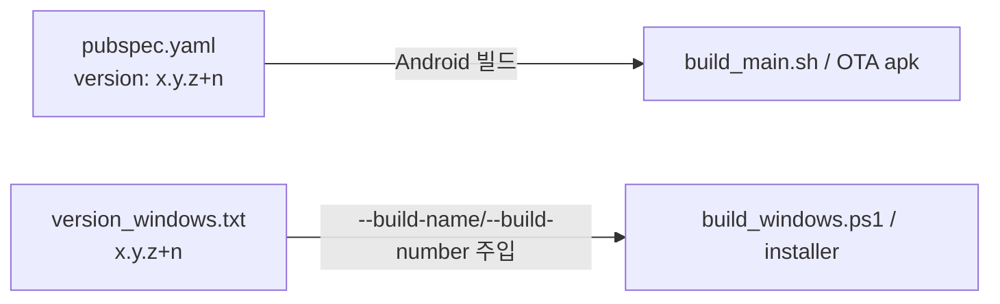

# 빌드 변형 흐름 (Build Variants Flow)

`japan` / `korea` 두 변형이 하나의 코드베이스에서 어떻게 분기되는지의 **시각적 흐름**만 담은 문서다.
빌드/배포 **명령어·환경설정·인스톨러**는 [docs/BUILD.md](BUILD.md)에 있으므로 여기서는 분기 구조와 채널 분리에 집중한다.

> 한 줄 요약: **단일 패키지·단일 exe로 통합**. `--dart-define=APPFIT_VARIANT` → `AppEnv.isKorea` → (release 서버 분기 japanLive/live + UpdateConfig·OtaConfig **OTA 채널만** 분기).
> applicationId·Windows exe명·mutex·설치 GUID는 국가와 무관하게 하나로 통일되어, **머신당 하나만 설치/실행**된다(병존 불가).

---

## 1. 변형 분기

- `AppEnv.region`은 `String.fromEnvironment('APPFIT_VARIANT', defaultValue: 'japan')`, `isKorea = region == 'korea'` ([app_env.dart](../lib/config/app_env.dart)). 둘 다 **const**여야 함(getter 불가 — 컴파일 타임 트리 셰이킹). dart-define 키 이름은 `APPFIT_VARIANT` 그대로이고 값만 `japan`/`korea` 로 쓴다.
- release 빌드는 변형에 따라 서버가 고정된다: `main.dart` 가 `AppEnv.isKorea` 로 `japan→japanLive`, `korea→live` 서버를 선택한다(`AppFitConfig.configure` 이전). 서버선택 UI는 릴리즈에서 잠긴다(`AppEnv.showInternalUi`).
- **Android flavor 없음**: applicationId 는 국가 무관하게 `co.kr.waldlust.order.receive.appfit` 하나. 변형은 dart-define 로만 주입된다.
- **Windows 네이티브 통일**: exe명(BINARY_NAME)·mutex·윈도우 제목·설치 GUID 가 국가와 무관하게 단일. CMake variant 분기와 `APPFIT_VARIANT_KOREA` 매크로는 제거됐다.

---

## 2. japan vs korea 비교

> 통합 후 **applicationId·exe명·mutex·설치 GUID·임시 파일은 국가 무관하게 동일**하다.
> 국가별로 다른 것은 **release 서버**와 **OTA 채널 URL**, 그리고 화면의 **KR/JP 배지**뿐이다.

| 항목 | japan | korea |
| --- | --- | --- |
| 목표 | 일본 매장 | 한국 신규 900매장(아직 미배포) |
| applicationId | `co.kr.waldlust.order.receive.appfit` | ← 동일 |
| release 서버 | `japanLive` | `live` |
| Windows exe | `appfit_order_agent.exe` | ← 동일 |
| Windows mutex / 설치 GUID | 단일 | ← 동일 |
| Windows version json | `appfit_order_agent_windows_version.json` (레거시, 계속 사용) | `appfit_order_agent_korea_windows_version.json` |
| Windows zip | `appfit_order_agent_windows.zip` (레거시, 계속 사용) | `appfit_order_agent_korea_windows.zip` |
| Windows installer 출력명 | `AppfitOrderAgent-Setup-<ver>.exe` | `AppfitOrderAgentKorea-Setup-<ver>.exe` |
| Android version json | `appfit_order_agent_japan_version.json` | `appfit_order_agent_korea_version.json` |
| Android apk | `appfit_order_agent_japan.apk` | `appfit_order_agent_korea.apk` |

- 공통 OTA base URL: `http://waldpay.kokonutstamp2.com/`. 타임아웃: connect 15s / check 10s / download 10m ([update_config.dart](../lib/config/update_config.dart), [ota_config.dart](../lib/config/ota_config.dart)).
- **Android 레거시 채널 동결(FROZEN)**: 무접미 `appfit_order_agent.apk` / `appfit_order_agent_version.json` 은 구 패키지(`co.kr.waldlust.order.receive`)로 설치된 일본 매장 1곳 전용이라 **업로드 금지**. 신규 japan 빌드는 `_japan` 채널로 올린다.
- **Windows japan 은 레거시 채널 계속 사용(동결 아님)**: Windows 는 패키지 개념이 없고 exe명이 통일되어 기존 japan 설치본이 레거시 채널로 자연 업데이트된다. Android 와 정책이 반대이니 주의.
- 통합으로 두 변형이 같은 머신에서 **병존 불가**(mutex·GUID 단일). 재설치 시 in-place 업그레이드된다.

---

## 3. 버전 정본 이원화

- **Android 버전 정본 = `pubspec.yaml`**, **Windows 버전 정본 = `version_windows.txt`**. 둘은 분리(Windows 빌드 스크립트는 pubspec을 읽지 않음).
- `build_windows.ps1`/`deploy_windows.ps1`/`build_installer.ps1`이 `version_windows.txt`에서 build-name/number를 읽어 주입(CLAUDE.md 절대 규칙). 빌드 명령은 [docs/BUILD.md](BUILD.md).

---

## 4. 핵심 파일 색인

| 파일 | 역할 |
| --- | --- |
| [app_env.dart](../lib/config/app_env.dart) | `region`/`isKorea`(const, `APPFIT_VARIANT`) |
| [main.dart](../lib/main.dart) | `AppEnv.isKorea` 로 release 서버(japanLive/live) 분기 |
| [update_config.dart](../lib/config/update_config.dart) | Windows OTA 채널 URL 분기(임시파일은 통일) |
| [ota_config.dart](../lib/config/ota_config.dart) | Android OTA 채널 URL 분기(레거시 동결 경고) |
| [windows/runner/main.cpp](../windows/runner/main.cpp) | 단일 mutex/제목(변형 분기 제거) |
| [version_windows.txt](../version_windows.txt) | Windows 버전 정본 |
| [pubspec.yaml](../pubspec.yaml) | Android 버전 정본 |
