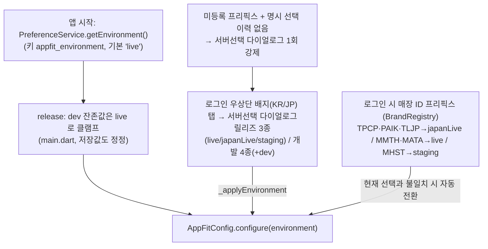
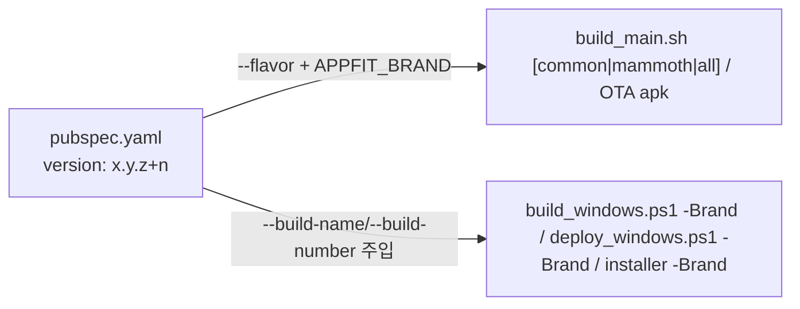

# 브랜드 아티팩트 모델 (2-Tier)

빌드가 국가와 브랜드를 어떻게 다루는지의 **시각적 흐름**만 담은 문서다.
빌드/배포 **명령어·환경설정·인스톨러**는 [docs/BUILD.md](BUILD.md)에 있으므로 여기서는 서버 결정 구조, 브랜드 아티팩트 티어, OTA 채널에 집중한다.

> 한 줄 요약: **국가는 빌드를 가르지 않는다** — 서버(live/japanLive/staging)는
> 항상 **런타임**에 결정된다(저장값 + 로그인 화면 서버선택 배지 + 매장 ID
> 프리픽스 자동 전환). 빌드를 가르는 축은 **브랜드 아티팩트 티어** 하나뿐이다.
> Tier 0(공통, 기본)은 applicationId·Windows exe명/mutex/설치 GUID 가
> 국가와 무관하게 하나로 통일되어 **머신당 하나만 설치/실행**된다. Tier 1
> (전용, 현재 맘모스)은 자기만의 applicationId/exe명/설치 GUID 를 가져 Tier 0
> 과 **같은 머신에 병존 설치**할 수 있다.

---

## 0. 2-티어 아티팩트 모델

| 티어 | 슬러그 | 대상 | Android applicationId | Windows exe |
| --- | --- | --- | --- | --- |
| Tier 0(기본) | `common` | 대부분의 브랜드 | `co.kr.waldlust.order.receive.appfit` | `appfit_order_agent.exe` |
| Tier 1(예외) | `mammoth` | 맘모스 | `co.kr.waldlust.order.receive.appfit.mammoth` | `appfit_order_agent_mammoth.exe` |

두 티어는 **같은 코드·같은 커밋·같은 버전**이다. 다른 것은 OS 셸 아이덴티티
(applicationId, 런처 label/icon, Windows exe명·mutex·설치 GUID)와 OTA 채널
뿐이며, 서버 환경·`BrandFeature`·프린터/주문 로직·i18n 분기는 전부
`lib/utils/brand_registry.dart`(`BrandRegistry`) 런타임 정본으로 남는다.
[test/config/build_brand_scope_test.dart](../test/config/build_brand_scope_test.dart)
가 `BuildBrand`(`lib/config/build_brand.dart`) 참조 파일을 화이트리스트로
고정해 이 경계가 코드로 번지는 것을 막는다.

Tier 1 승격 조건은 [docs/RELEASE.md](RELEASE.md) 대원칙 참조(3개 전부 충족
필요, `/add-brand` 마지막 단계에서 강제 질문). 빌드 명령은 `--flavor`(Android)
/ `-Brand`(Windows) 인자로 티어를 고른다 — 자세한 스크립트 인자는
[docs/BUILD.md](BUILD.md).

---

## 1. 서버 결정 (런타임)

- 저장 키: `appfit_environment`(기본 `live`), 명시 선택 이력: `appfit_environment_manual_override`(배지/다이얼로그에서 선택 시 기록 — 미등록 프리픽스의 1회 다이얼로그 재출현 방지).
- 전환 시퀀스([login_screen.dart](../lib/screens/login_screen.dart) `_applyEnvironment`): WebSocket 해제 → 환경 저장 → `AppFitConfig.configure` → 토큰/자격증명 정리 → tokenManager/dio invalidate. `appFitNotifierServiceProvider` 는 invalidate 금지(`late final` — disconnect 만). 순서 변경 금지(서버 전환 후 재로그인 크래시 방어).
- 프리픽스 자동 전환은 **live/japanLive 세션에서만** 동작한다(개발 빌드의 dev/staging 테스트 보호). live 에서 스테이징 프리픽스 입력 → 전환은 되지만, 그 반대(staging 세션에서 live 프리픽스 입력 → 자동 복귀)는 **안 된다** — 개발자가 고른 staging 을 앱이 임의로 뺏지 않기 위함(맘모스: `MHST`→staging 은 자동 전환, `MMTH`→live 로의 자동 복귀는 없음. 로그인 화면 서버 선택으로 수동 복귀).
- 한 브랜드가 프리픽스를 여러 개 가질 수 있다(`BrandMeta.prefixEnvironments`,
  `Map<프리픽스, 서버환경>`). 맘모스가 유일한 사례: `MMTH`=운영(live),
  `MHST`=스테이징(staging).

---

## 2. 산출물과 OTA 채널

채널은 브랜드가 아니라 **아티팩트**에 종속된다([docs/RELEASE.md](RELEASE.md)
채널 불변식). Tier 1 아티팩트마다 정확히 채널 1세트가 있다.

| 플랫폼 | 티어 | 산출물 | OTA 채널 (version JSON / 파일) |
| --- | --- | --- | --- |
| Android | 공통 | `app-common-release.apk` (`….appfit`) | `appfit_order_agent_release_version.json` / `appfit_order_agent_release.apk` |
| Android | 맘모스 | `app-mammoth-release.apk` (`….appfit.mammoth`) | `appfit_order_agent_mammoth_release_version.json` / `appfit_order_agent_mammoth_release.apk` |
| Windows | 공통 | `appfit_order_agent.exe` (Release 폴더 ZIP) | `appfit_order_agent_windows_version.json` / `appfit_order_agent_windows.zip` (레거시 무접미 계속 사용) |
| Windows | 맘모스 | `appfit_order_agent_mammoth.exe` (Release 폴더 ZIP) | `appfit_order_agent_mammoth_windows_version.json` / `appfit_order_agent_mammoth_windows.zip` |

- 공통 OTA base URL: `http://waldpay.kokonutstamp2.com/`. 타임아웃: connect 15s / check 10s / download 10m ([update_config.dart](../lib/config/update_config.dart), [ota_config.dart](../lib/config/ota_config.dart)).
- **Android 공통은 레거시 채널 동결(FROZEN)**: 무접미 `appfit_order_agent.apk` / `appfit_order_agent_version.json` 은 구 패키지(`co.kr.waldlust.order.receive`)로 설치된 일본 매장 1곳 전용이라 **업로드 금지**(신규 패키지로 수동 재설치 시까지). 구 `_japan`/`_korea`/`_appfit` 채널은 폐기(미사용).
- **Windows 공통은 레거시 채널이 곧 정본 채널(동결 아님)**: 패키지 개념이 없고 exe명이 동일해 기존 설치본이 자연 업데이트된다. Android 와 정책이 반대이니 주의.
- **맘모스는 두 플랫폼 모두 신설 채널이다**: 자기 패키지/exe명 때문에 공통 채널의 산출물을 받아도 물리적으로 적용할 수 없다(Android 는 패키지 불일치로 설치 실패, Windows 는 파일명이 달라 자연 업데이트가 안 걸림). 맘모스의 실제 운영 정책은 Sunmi App Store 경로이고, 이 OTA 채널은 비-Sunmi 단말·수동 체크의 안전망이다.
- 한 채널 안에서는 지역 구분이 없으므로 업로드 즉시 **한국/일본 동시 롤아웃**된다(지역별 시차 배포 불가) — 이건 티어와 무관하게 불변이다.

---

## 3. 버전 정본 단일화

- **Android·Windows 버전 정본 = `pubspec.yaml`의 `version`** 하나다. 두 티어도 이 정본을 공유한다 — 과거의 `version_windows.txt`는 폐지됐다.
- Windows 스크립트(`build_windows.ps1`/`deploy_windows.ps1`/`build_installer.ps1`/`archive_windows.ps1`)가 `pubspec.yaml`에서 build-name/number를 읽어 주입(CLAUDE.md 절대 규칙). 빌드 명령은 [docs/BUILD.md](BUILD.md).
- 버전 번호가 플랫폼·티어 공유이므로, 하나만 배포해도 다음 배포의 빌드번호는 함께 증가한다(OTA는 아티팩트별 채널 JSON 기준이라 문제 없음). 두 Android 아티팩트를 함께 릴리즈할 때는 **같은 커밋·같은 versionCode**로 만드는 것이 불변식이다(`./build_main.sh all` 이 연속 빌드 후 versionCode 동일 여부를 출력).

---

## 4. 핵심 파일 색인

| 파일 | 역할 |
| --- | --- |
| [main.dart](../lib/main.dart) | 시작 시 저장 환경 로드 + release 클램프 + 맘모스 flavor 로그인 전 테마 프리시드(저장 슬롯이 빈 경우만) |
| [login_screen.dart](../lib/screens/login_screen.dart) | 서버 배지·선택 다이얼로그·`_applyEnvironment`·프리픽스 자동 전환·로그인 로고(맘모스 flavor 고정) |
| [brand_registry.dart](../lib/utils/brand_registry.dart) | 브랜드별 `prefixEnvironments`(프리픽스→서버환경 Map) SSOT |
| [build_brand.dart](../lib/config/build_brand.dart) | 빌드 시점 브랜드 슬러그(`BuildBrand.slug`/`isMammoth`) — 사정거리는 OS 셸 아이덴티티 + OTA 채널까지 |
| [ota_config.dart](../lib/config/ota_config.dart) | Android OTA 채널(아티팩트별 `_release`/`_mammoth_release`) + 레거시 동결 경고 |
| [update_config.dart](../lib/config/update_config.dart) | Windows OTA 채널(공통은 레거시 무접미 유지, 맘모스는 `_mammoth_windows` 신설) |
| [windows/CMakeLists.txt](../windows/CMakeLists.txt) | `$ENV{APPFIT_BRAND}` 로 BINARY_NAME 분기 |
| [windows/runner/main.cpp](../windows/runner/main.cpp) | 브랜드별 mutex/제목(`APPFIT_BRAND_MAMMOTH` #ifdef) |
| [installer/appfit_order_agent.iss](../installer/appfit_order_agent.iss) | 브랜드별 AppName/ExeName/Mutex/AppId(`AppfitBrand` ISCC 매크로) |
| [build_brand_scope_test.dart](../test/config/build_brand_scope_test.dart) | `BuildBrand` 참조 파일 화이트리스트 — 빌드 축이 로직으로 번지는 것을 막는 규율 테스트 |
| [pubspec.yaml](../pubspec.yaml) | Android·Windows·양쪽 티어 공통 버전 정본 |
