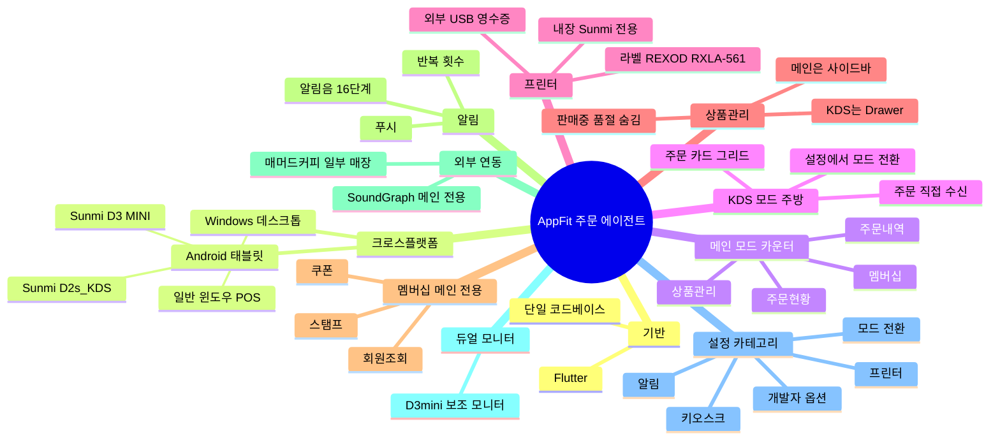
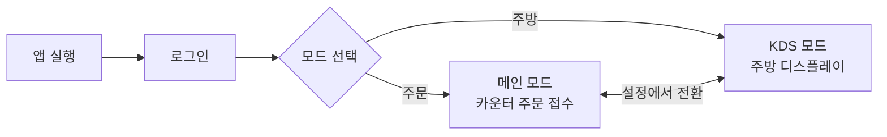

# AppFit 주문 에이전트 — 기능 요약

### 전체 진입 흐름

## 주문접수 프로그램 개발 현황

| 단계 | 버전 | 설명 |
|------|------|------|
| 1 | Version 1 | Android Native | 미운영 |
| 2 | Version 2 | Flutter 기반 Android 전환 | 매머드커피 운영 (현재 939개 기기 설치)
| 3 | Version 3 | Version 2 를 기반으로 백엔드를 PHP → AppFit 으로 전환 및 UI 개편 | 도쿄플라츠 운영
| 4 | Version 2 Windows | 매머드 동대문구청점 운영
| 5 | Version 3 Windows | Version 2 Windows 환경으로 포팅 작업의 일환으로 AppFit에도 적용 |

> 현재 **Version 2(PHP)** 와 **Version 3(AppFit)** 모두 **Android · Windows 환경을 지원**.

## 1. Flutter 기반

| 항목 | 내용 |
|------|------|
| 프레임워크 | Flutter |
| 특징 | 하나의 코드로 여러 운영체제 앱을 동시에 개발 |

## 2. 크로스플랫폼 — Android · Windows 동시 지원

같은 앱을 안드로이드 단말과 윈도우 PC에서 모두 사용.

| 플랫폼 |주요 단말 |
|------|------|
| Android |  Sunmi D3 MINI, D2s_KDS, 안드로이드 태블릿 등 |
| Windows |  윈도우 POS |

## 3. 메인 모드 (주문 접수)

주 용도: 카운터에 배치. 주문접수 / 주문상태변경 / 상품관리.

| 영역 | 설명 |
|------|------|
| 좌측 탭 | 주문현황 / 주문내역 / 상품관리 / 멤버십 |
| 상단 표시 | 시간, 네트워크 상태, 로그아웃 버튼 |
| 주문현황 탭 | 신규 / 준비중 / 준비완료 / 완료 4단계를 위→아래로 동시 노출 |
| 카드 형태 | 작은 정사각형 카드를 가로로 나열 |
| 상세 보기 | 카드를 누르면 주문 상세 팝업 |

## 4. KDS 모드 (주방 디스플레이)

주 용도: 주방에서 보는 큰 카드 디스플레이. 카드 안에 메뉴와 옵션이 크게 보이고 좌우로 스크롤.

| 영역 | 설명 |
|------|------|
| 상단 탭 | 전체 / 진행 / 픽업 / 완료 / 취소 + 정렬·일괄완료 버튼 |
| 카드 배치 | 한 카드씩 크게, 좌우로 스크롤 |
| 카드 구성 | 주문번호·항목 수·접수 시각 / 메뉴 리스트 / 상태 전환 버튼 / 메모 |

### 4.1 KDS 모드에서 주문 직접 수신 기능 **추가**

KDS 모드 단독으로도 사용 가능.

### 4.2 모드 전환

메인 모드 ↔ KDS 모드 전환은 **설정 화면에서 언제든 가능**.

## 5. 프린터

매장 환경에 맞춰 내장·외부·라벨 프린터를 각각 켜고 끌 수 있음. 내장·외부프린터 주문서/영수증 각각 출력 여부 지정 가능. 

| 구분 | 용도 |
|------|------|
| 내장 영수증 | Sunmi 내장프린터 지원 디바이스 전용 |
| 외부 영수증 | USB 연결한 별도 영수증 프린터 | 
| 라벨 | 컵에 붙이는 메뉴 라벨 | 5*7cm 용지 REXOD RXLA-561 모델만 검증 

### 5.1 네트워크 장애 시 주문/출력 자동 복구

서버오류·인터넷 순단으로 주문 상세조회가 실패해도 주문이나 출력이 누락되지 않도록 다층 방어가 동작합니다(운영자 개입 불필요).

1. **재시도**: 신규 주문의 메뉴 정보 조회가 일시 실패(서버 5xx·타임아웃)하면 자동으로 짧게 재시도하고, 회복되면 그대로 정상 접수·출력됩니다.
2. **누락 방지**: 재시도가 끝까지 실패해도 폴링(주기적 동기화)이 주문을 다시 받아 화면에 표시하므로 **주문 누락이 없습니다**.
3. **잘못된 영수증 차단**: 메뉴 정보를 못 받은 주문은 **내용이 빈 영수증/라벨을 발행하지 않습니다**.
4. **자동 재발행**: 인터넷이 복구되어 메뉴 정보가 채워지는 순간, 누락됐던 영수증·라벨이 **자동으로 1회 재발행**됩니다(중복 출력 없음). 즉 "접수는 됐는데 영수증이 안 나온" 주문이 복구 시 운영자 개입 없이 출력됩니다.

## 6. 상품관리

| 항목 | 설명 |
|------|------|
| 기능 | 판매 상품을 **판매중 / 품절 / 숨김** 중 하나로 전환 |
| 부가 기능 | 카테고리 분류 보기, 상품명 검색 |
| 메인 모드 진입 | 좌측 사이드바 **상품관리 탭** |
| KDS 모드 진입 | 왼쪽 **Drawer 메뉴(햄버거 버튼) → 상품관리** |

## 7. 멤버십 (메인 모드 전용)

| 항목 | 설명 |
|------|------|
| 기능 | 전화번호·바코드로 회원 조회, 스탬프 적립·취소, 쿠폰 사용·취소, 보유 쿠폰 확인 |
| 진입 | 좌측 사이드바 **멤버십 탭** |
| 모드 제약 | **메인 모드 전용** — KDS 모드에서는 진입점 없음 |

## 8. 모드별 기능 매트릭스

두 모드는 같은 주문 데이터(WebSocket 수신)를 공유하지만, UI와 일부 기능 동작이 다릅니다.

| 기능 | 메인 모드 | KDS 모드 | 비고 |
|---|:---:|:---:|---|
| 주문 자동 접수 | O (픽업 오더 자동접수) | O (KDS 자동접수) | 모드별 별도 옵션 |
| 주문 완료 처리 | 주문 상세 팝업에서 | 픽업 탭의 완료 버튼 | READY → DONE 전이 |
| 영수증 인쇄 | 신규 주문 시 자동 | KDS 자동접수가 ON인 경우에만 | 출력 정책이 모드별로 분기 |
| 라벨 인쇄 | O | O | 모드 무관 |
| 메뉴/상품 관리 | 좌측 탭에서 직접 접근 | Drawer 메뉴에서 진입 | 메인 모드 위주 |
| 주문 내역 조회 | 주문내역 탭 | 전체 탭 | 모드 무관 |
| 멤버십 (스탬프·쿠폰) | O | 미제공 | 메인 모드 전용 |

## 12. 설정 화면 구성

설정 화면은 한 화면을 공유하되, **현재 모드에 따라 일부 항목이 숨김/노출**됩니다.

### 12.1 설정 항목 매트릭스

| 카테고리 | 항목 | 메인 모드 | KDS 모드 |
|---|---|:---:|:---:|
| **모드 관리** | 모드 전환 (Main ↔ KDS) | O | O |
|  | KDS 주문 자동접수 |  | O |
|  | 픽업 오더 자동접수 | O |  |
| **일반** | PC 시작 시 자동 실행 | O | O |
|  | 매장/포장 표시 | O | O |
|  | 타 기기 진행상태 알림 무시 |  | O |
|  | 화면 상하 반전 | O | O |
|  | 언어 (한국어/영어/일본어) | O | O |
|  | 화폐 단위 (KRW/JPY) | O | O |
| **프린터** | 주문서 출력 ON/OFF | O | O |
|  | 내장 프린터 사용 + 주문서/영수증 매트릭스 | O | O |
|  | 외부 프린터 사용 + 주문서/영수증 매트릭스 | O | O |
|  | 라벨 프린터 사용 + 필터 모드 | O | O |
|  | 주문서 출력 매수 (1~5) | O | O |
| **알림** | 알림음 크기 (0~15) | O | O |
|  | 알림음 선택 (2종) | O | O |
|  | 알림 반복 횟수 | O | O |
| **키오스크** | 키오스크 주문 노출 | O | O |
|  | 키오스크 주문 출력/알람 | O | O |
| **외부 연동** | SoundGraph 활성화 + 마켓 ID | O |  |
| **업데이트** | 자동 업데이트 확인 | O | O |

