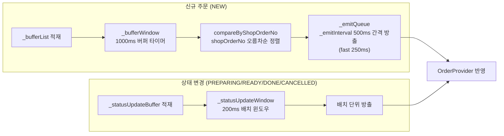
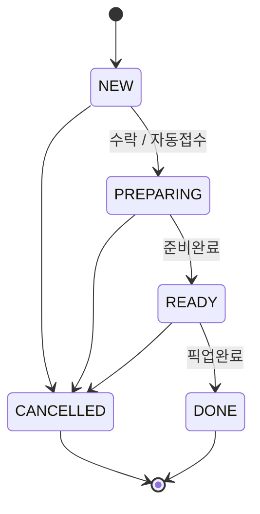
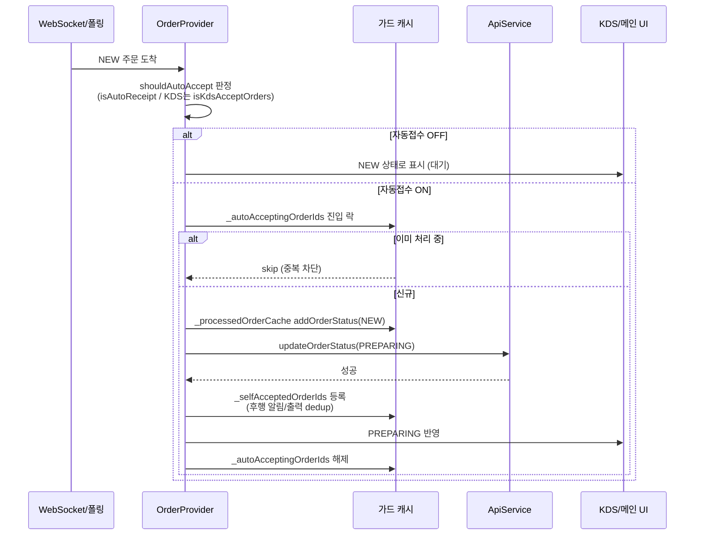
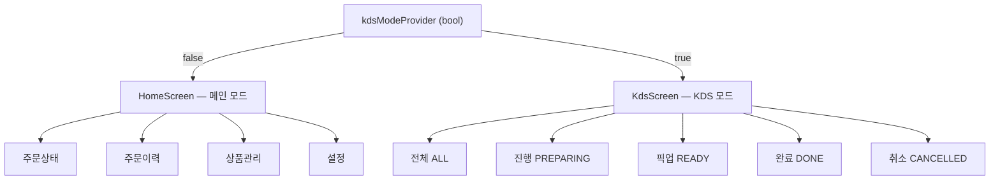
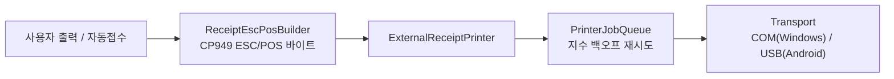

# 주문 데이터 흐름 (Order Data Flow)

AppFit 주문 에이전트의 **핵심 파이프라인** — 주문이 서버에서 들어와 화면에 표시되고,
사용자/자동 처리로 상태가 바뀌고, 출력으로 이어지는 전 과정을 도식화한 문서다.
출력 내부·인증·브랜드 등은 범위 밖이며 [docs/ARCHITECTURE.md](ARCHITECTURE.md) 를 참고한다.

> 한 줄 요약: **WebSocket/폴링 이중 소스 → 큐(버퍼·정렬·방출) → OrderProvider/OrderState → 계산 Provider → KDS/메인 UI → API 상태 업데이트 → 출력**.
> 소켓·폴링 이중화와 다중 캐시(`ProcessedOrderCache`, 자동접수 락 등)로 중복 접수·상태 다운그레이드·출력 누락을 방어한다.

---

## 1. 전체 데이터 흐름

```mermaid
flowchart TD
    WS["WebSocket<br/>AppFitNotifier 구독"]
    POLL["폴링 타이머<br/>주기적 refreshOrders"]
    SOCK["OrderSocketManager<br/>수신·재연결"]
    QUEUE["OrderQueueManager<br/>버퍼·정렬·방출"]
    PROV["OrderProvider<br/>주문 처리 로직"]
    STATE["OrderState<br/>orders·activeOrderCount·설정"]
    COMPm["orderStatusOrdersProvider<br/>메인 필터·정렬"]
    COMPk["kdsTabOrdersProvider<br/>KDS 5탭 필터·정렬·카운트"]
    UI["UI 화면<br/>HomeScreen / KdsScreen"]
    API["ApiService<br/>상태 업데이트·상세조회"]
    PRINT["출력 연계<br/>영수증·라벨"]

    WS --> SOCK
    POLL --> SOCK
    SOCK --> QUEUE
    QUEUE --> PROV
    PROV --> STATE
    STATE --> COMPm
    STATE --> COMPk
    COMPm --> UI
    COMPk --> UI
    UI -->|사용자 액션| PROV
    PROV -->|updateOrderStatus| API
    API --> PROV
    PROV --> PRINT
```

**핵심 파일**

- [order_socket_manager.dart](../lib/providers/order/order_socket_manager.dart) — WebSocket 수신·재연결, 끊김 시 구독 해제
- [order_queue_manager.dart](../lib/providers/order/order_queue_manager.dart) — 수신 주문 버퍼·정렬·간격 방출
- [order_provider.dart](../lib/providers/order/order_provider.dart) — `OrderState` 관리, 자동접수·상태 업데이트 로직 (keepAlive)
- [order_state.dart](../lib/models/order_state.dart) — `orders`, `activeOrderCount`, `isAutoReceipt`, `isKdsAcceptOrders` 등 상태 모델
- [order_computed_providers.dart](../lib/providers/order/order_computed_providers.dart) — `orderStatusOrdersProvider`(메인), `kdsTabOrdersProvider`(KDS) 파생

---

## 2. 주문 큐 파이프라인

수신 폭주·순서 역전을 흡수하기 위해 신규 주문과 상태 변경을 **별도 윈도우**로 처리한다.

- **신규 주문**: `_bufferWindow`(1000ms) 동안 모았다가 `shopOrderNo` 오름차순 정렬 후, `_emitInterval`(500ms, fast 250ms) 간격으로 한 건씩 방출 → 화면 순서·연출 안정화.
- **상태 변경**: `_statusUpdateWindow`(200ms)로 묶어 배치 방출 → 잦은 갱신의 리빌드 비용 절감.
- 버퍼/방출 큐 진입 시 동일 `orderId` 중복은 차단.

값 출처: [order_queue_manager.dart](../lib/providers/order/order_queue_manager.dart) 의 `_bufferWindow`, `_emitInterval`, `_emitIntervalFast`, `_statusUpdateWindow` 상수.

---

## 3. 주문 상태머신

- 진행도는 단조 격자: `NEW(0) < PREPARING(1) < READY(2) < DONE(3)`. `CANCELLED` 는 진행도 비교에서 제외되는 **터미널 분기**.
- 폴링·소켓 응답을 합칠 때 `resolveMergedStatus(local, server)` 가 **다운그레이드(예: PREPARING→NEW)를 차단**하고, 한쪽이라도 `CANCELLED` 이면 취소를 우선한다.

**핵심 파일**: [order_status.dart](../lib/models/enums/order_status.dart) — `OrderStatus` enum, 진행도 격자, `resolveMergedStatus`.

---

## 4. 자동접수 시퀀스

NEW 주문을 자동으로 `PREPARING` 으로 올리는 흐름. **메인 모드**(`isAutoReceipt`)와 **KDS 단독 모드**(`isKdsAcceptOrders`) 두 경로가 있으며, 중복 접수·중복 알림/출력을 막는 가드가 핵심이다.

**중복/부활 방지 가드** (모두 [order_provider.dart](../lib/providers/order/order_provider.dart))

| 가드 | 역할 |
| --- | --- |
| `_autoAcceptingOrderIds` | 자동접수 in-flight 락 — 동시 진입 중복 접수 차단 |
| `_processedOrderCache` | `queueOrderExternal` enqueue 단계에서 외부 소켓 KDS PREPARING 이벤트 중복 차단 |
| `_selfAcceptedOrderIds` | 자가 접수 후행으로 들어오는 알림/출력 통째 스킵 |
| `_acceptedAtCreationOrderIds` | 생성 시점부터 PREPARING 인 주문의 표식 — PREPARING 분기의 출력 게이트를 KDS 모드가 아닐 때도 여는 유일한 근거 (1회성 소비) |
| `_recentRemovals` | 사용자 수동 삭제 후 폴링/소켓에 의한 부활 방지 (TTL) |
| `_pendingDetailReprint` | 상세조회 실패 시 메뉴 복구 후 재발행 대상 추적 |

### 생성 시점부터 PREPARING 인 주문 (NICE_KIOSK 류)

결제와 동시에 `PREPARING` 으로 만들어지는 주문은 앱이 접수 단계를 거치지 않아 NEW 파이프라인(자동접수·알림·출력)에 전혀 걸리지 않는다. 유입은 소켓 매니저가 `isExternallyAcceptedAtCreation`(= `ORDER_CREATED && PREPARING`)으로 분류해 `ingestExternallyAcceptedOrder` 로 보내고, 이 함수가 **표식 → 사운드그래프 → 큐** 순서를 소유한다(호출부에 순서 계약을 남기지 않기 위함 — 표식이 늦으면 출력 게이트가 닫힌 채 판정된다).

`ORDER_CREATED` 로 한정하는 것이 판정의 전부다. 다른 단말이 접수한 주문은 `ORDER_ACCEPTED` 로 전이를 보므로 걸리지 않는다 — 이 구분이 없으면 매장에 깔린 단말 수만큼 같은 주문서가 중복 출력된다.

출처(키오스크/POS) 억제 판정에는 반드시 `isSourceNotifyEnabled` 를 쓴다. `shouldNotifyForOrder` 는 `status == NEW` 일 때만 억제를 적용해서, PREPARING 주문은 설정을 OFF 해도 통과해 버린다.

**알려진 한계**

- **폴링으로 처음 발견된 PREPARING 주문은 출력되지 않는다.** `_processNewOrdersWhenRefresh` 는 `status == NEW` 만 필터하고 `refreshOrders` 는 `_processOrderByStatus` 를 호출하지 않는다. 폴링 응답에는 eventType 이 없고 `OrderModel` 에 `acceptedAt`/`acceptedBy`/`deviceId` 가 없어 "생성시점 PREPARING" 과 "다른 단말이 이미 접수·출력한 주문" 을 **원리적으로 구분할 수 없다** — 서버 필드 추가 없이는 해결 불가.
- **소켓 상세조회 3회 실패 시 이 경로에는 안전망이 없다.** 노출 OFF 면 state 에 없어 `_pendingDetailReprint` 가 `refreshOrders` 의 `retainWhere` 에서 지워지고, 폴링은 NEW 만 줍는다. NEW 주문과 달리 소켓 1회가 유일한 기회다.
- **KDS 모드 + `getKdsAcceptOrders()==false`** 에서는 `ORDER_CREATED` 가 `_shouldIgnoreByDomainPolicy`(소켓 매니저)에서 폐기되어 같은 증상이 KDS 에도 존재한다(사운드그래프 전송조차 안 됨). 별도 이슈.

---

## 5. UI 분기 (메인 vs KDS)

- 토글은 `kdsModeProvider` ([kds_unified_providers.dart](../lib/providers/kds/kds_unified_providers.dart)) 로 관리. 전환 시 `KdsScreen` ↔ `HomeScreen` 즉시 교체.
- **활성 주문 정의 차이**: 메인 = `NEW + PREPARING`, KDS = `PREPARING` 만 (`activeOrderCount`).
- KDS는 탭별 독립 정렬 방향·스크롤 컨트롤러를 추적하고, 신규 주문 감지 시 맨 위로 자동 스크롤.

**핵심 파일**: [home_screen.dart](../lib/screens/home_screen.dart), [kds_screen.dart](../lib/screens/kds_screen.dart).

---

## 6. 출력 연계 (요약)

주문 흐름과 **출력 계층의 접점만** 표시한다. 큐 백오프·transport 분기·FFI 등 내부 상세는 별도 문서로 다룰 여지.

- 라벨 출력은 별도 경로(`label_printer/`, Windows는 Dart FFI). 자세한 출력 안정성·프로브 설계는 후속 문서 예정.

---

## 7. 핵심 파일 색인

| 파일 | 역할 |
| --- | --- |
| [order_socket_manager.dart](../lib/providers/order/order_socket_manager.dart) | WebSocket 수신·재연결 |
| [order_queue_manager.dart](../lib/providers/order/order_queue_manager.dart) | 버퍼·정렬·간격 방출, 상태 배치 윈도우 |
| [order_provider.dart](../lib/providers/order/order_provider.dart) | `OrderState` 관리, 자동접수·상태 업데이트, 중복 방지 가드 |
| [order_state.dart](../lib/models/order_state.dart) | 주문 상태 모델(`orders`, `activeOrderCount`, 설정 플래그) |
| [order_computed_providers.dart](../lib/providers/order/order_computed_providers.dart) | 메인/KDS 파생 Provider |
| [order_status.dart](../lib/models/enums/order_status.dart) | 상태 enum·진행도 격자·`resolveMergedStatus` |
| [order_state_manager.dart](../lib/providers/order/order_state_manager.dart) | 활성 주문 계산, 단일 주문 업데이트 |
| [order_cache_manager.dart](../lib/providers/order/order_cache_manager.dart) | 상세조회 캐시 |
| [order_timer_manager.dart](../lib/providers/order/order_timer_manager.dart) | 폴링·경과시간 타이머 |
| [kds_unified_providers.dart](../lib/providers/kds/kds_unified_providers.dart) | `kdsModeProvider` 등 KDS 토글/상태 |
| [home_screen.dart](../lib/screens/home_screen.dart) | 메인 모드 4탭 |
| [kds_screen.dart](../lib/screens/kds_screen.dart) | KDS 모드 5탭 |
