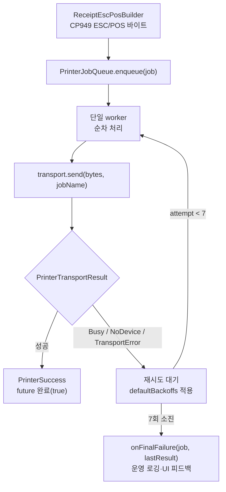
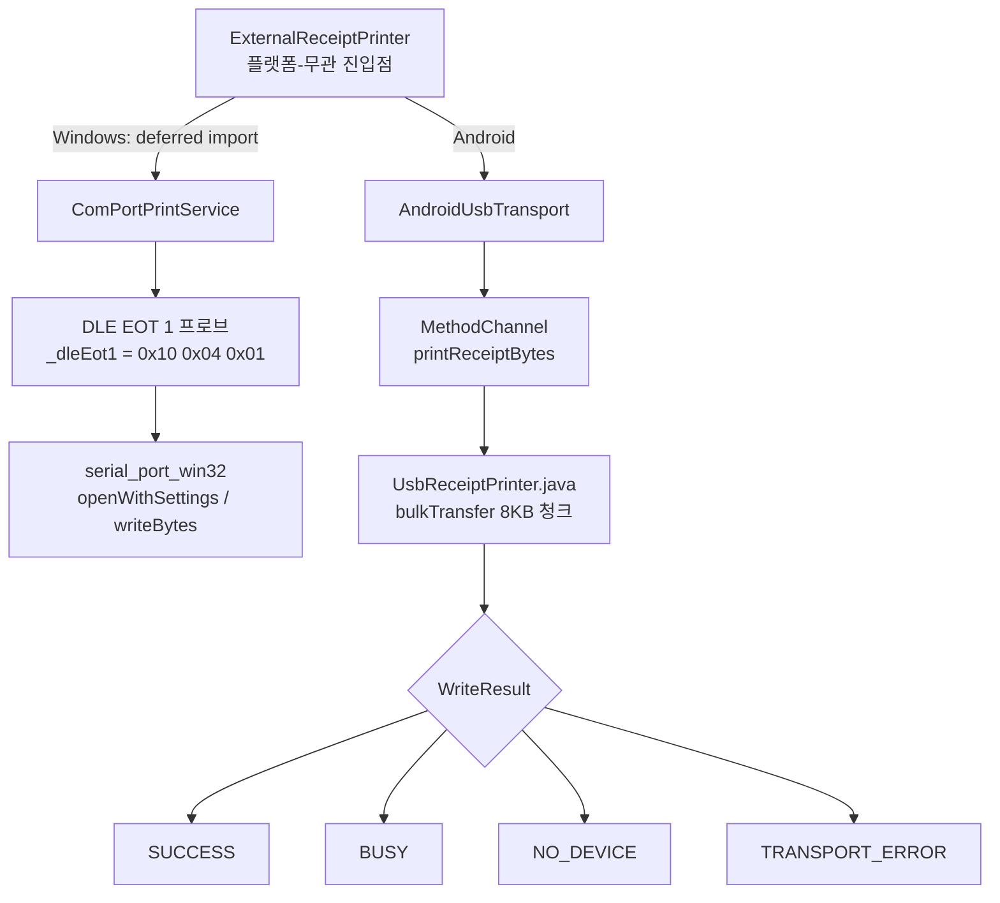
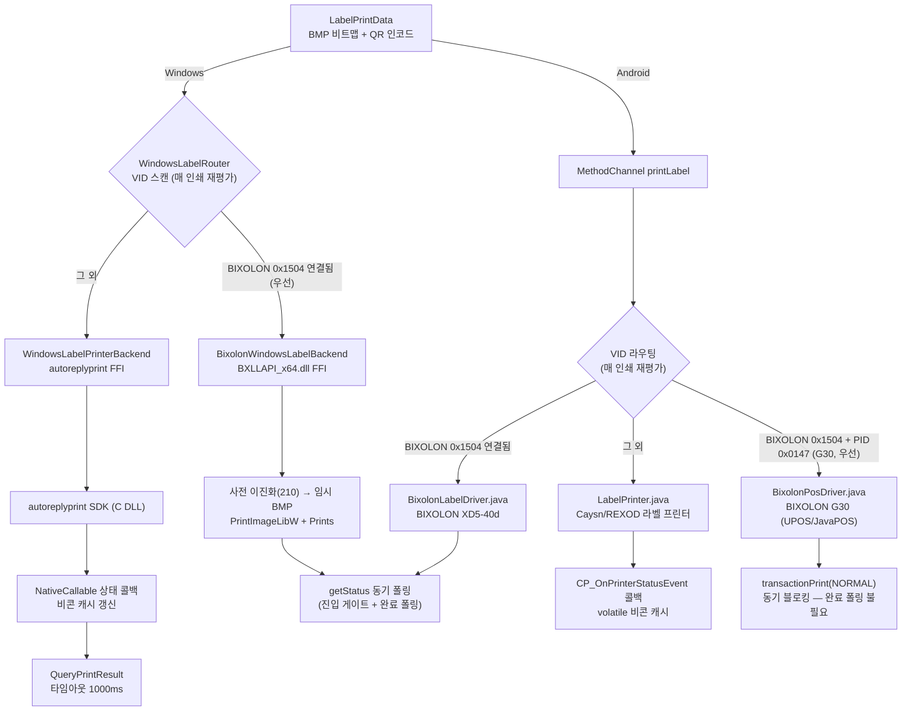
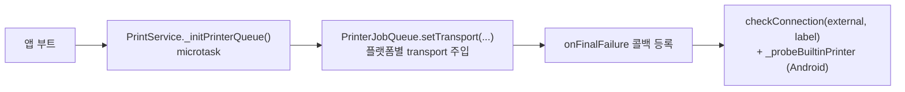

# 출력/프린터 계층 (Printer & Output Flow)

영수증·라벨 출력 경로를 도식화한 문서다. 매장 환경의 일시적 장애(POS 점유, USB 재연결, 느린 부팅)를
**큐 + 지수 백오프**로 흡수하고, **플랫폼별 transport**(Windows COM / Android USB)와 **라벨 FFI**로 분기한다.
주문 흐름과의 접점은 [docs/ORDER_FLOW.md](ORDER_FLOW.md) §6 참고.

> 한 줄 요약: **빌드(ESC/POS) → ExternalReceiptPrinter → PrinterJobQueue(백오프 재시도) → Transport(COM/USB) → 결과 분기 → 최종 실패 콜백**.
> 단일 출력 디바이스에 대한 동시 접근을 큐로 직렬화하고, 결과를 4종으로 분류해 재시도/포기를 판정한다.

---

## 1. 출력 큐 & 지수 백오프



**백오프 타임라인** ([printer_job_queue.dart](../lib/services/printer_job_queue.dart) `defaultBackoffs`)

| 시도 | 1 | 2 | 3 | 4 | 5 | 6 | 7 |
| --- | --- | --- | --- | --- | --- | --- | --- |
| 대기 | 즉시 | 2s | 5s | 10s | 20s | 40s | 60s |

- 총 7회, 누적 약 137초. 인덱스 0은 첫 시도(즉시), 1~6이 실제 백오프.
- `PrinterFinalFailureCallback = void Function(PrinterJob job, PrinterTransportResult lastResult)` — 최대 시도 초과 시 호출.
- 테스트는 `backoffsForTest` setter로 지연을 단축.

---

## 2. Transport 플랫폼 분기



**결과 4종** ([printer_transport.dart](../lib/services/printer_transport.dart))

| 타입 | 의미 | 재시도 |
| --- | --- | --- |
| `PrinterSuccess` | 출력 성공 | — |
| `PrinterBusy(reason)` | 디바이스 점유(POS 등) | O |
| `PrinterNoDevice(reason)` | 디바이스 없음/미연결 | O |
| `PrinterTransportError(reason)` | 전송 실패 | O |

- **Windows deferred import**: `serial_port_win32`의 정적 initializer가 Android 런타임에서 `kernel32.dll`을 찾으려다 크래시하는 것을 막기 위해 Windows transport를 지연 로드.
- **DLE EOT 1 프로브**: USB-Serial CDC 칩이 프린터 전원 OFF에도 bus power로 살아 있어 발생하는 false-positive("연결됨" 오판)를 차단. `_probeTimeout`(300ms), `_probeMaxAttempts`(5) 등으로 생존을 직접 확인 — 자세한 권위 판정은 메모리 `external_printer_liveness` 참조.
- **Android VID 화이트/블랙리스트**: Posbank(0x1552)·NXP(0x0D28) 허용, ASIX Ethernet(0x0B95) 제외. 청크 `CHUNK_SIZE` 8KB, 타임아웃 5000ms.

### 2.1 Windows 시리얼: 두 연결 형태 · 기본 보레이트 · serial_port_win32 함정

Windows COM 경로는 **두 가지 물리 연결을 동일 코드로 지원**한다 (2026-07 PR800 + NEXT-340PL COM6 실기 검증).

| 연결 형태 | 드라이버 | 특성 |
| --- | --- | --- |
| 프린터 내장 USB → USB-CDC 가상 COM (현장 표준) | usbser.sys 계열 | baud 무시, DSR/CTS 미전달(0x00), 무효 DCB도 관대하게 수용 |
| USB-RS232 어댑터(NEXT-340PL/PL2303 등) → 프린터 시리얼 포트 | ser2pl.sys 등 | DCB 검증 엄격, DSR/CTS 전달(0x30), 실제 wire 속도 존재(9600≈1KB/1.2s) |

**기본 보레이트 115200**: PR800 시리얼 포트 고정값(9600~57600은 DLE EOT 무응답, 115200만 0x16 응답). CDC는 baud를 무시하므로 전 연결타입 공통 기본값으로 안전. prefs 저장값이 항상 우선이며, 기본값 3지점은 함께 유지할 것 — `ComPortPrintService.defaultBaudRate` / `PreferenceService.getComPortBaudRate` / `ExternalPrinterSubSettings._defaultBaudRate`.

**serial_port_win32(1.4.2) 함정과 대응** (구현·근거 정본은 [com_port_print_service.dart](../lib/services/com_port_print_service.dart) 주석):

1. `openWithSettings`의 `StopBits`는 **DCB raw 값(0=1비트, 1=1.5비트, 2=2비트)**. 1을 넘기면 8데이터비트와 무효 조합이 되어 PL2303이 SetCommState에서 거부(open throw). CDC가 관대해 오래 잠복했던 버그 — 반드시 0 사용.
2. 패키지는 DCB를 zero-init 상태로 SetCommState 한다 → `_primeDcb`가 DCBlength/fBinary/Xon≠Xoff + DTR/RTS ENABLE을 선채움.
3. 패키지 open()이 CreateFile 후 SetCommState 등에서 throw 하면 **핸들을 누수**한다(이후 모든 재시도가 ACCESS_DENIED 락아웃). `_recoverLeakedHandle`이 openWithSettings throw 직후에만 회수 — 다른 시점 호출 금지(double-close 위험, 헬퍼 주석 참조).
4. `writeBytesFromUint8List`의 timeout은 시간이 아닌 **루프 반복 횟수**(unawaited delay 결함) → 실제 시리얼에서 write가 pending이기만 해도 false 반환. **write false ≠ 실패 확정** — probe는 RX 응답으로만 판정하고, 데이터 write 후 drain delay(전송시간+200ms)가 조기 close 잘림을 방지.
5. open 직후 `EscapeCommFunction(SETDTR/SETRTS)` assert — DTR/DSR 흐름제어 프린터가 host not-ready로 수신/응답을 보류하는 것을 방지.

**시리얼 무응답 트러블슈팅 순서**: ① COM enumerate 확인(케이블/드라이버) → ② open throw면 위 1·2(DCB) 의심 → ③ probe-timeout이면 보레이트 스윕(115200 우선) → 프린터 전원 → 배선(널모뎀) 순으로 분리. DLE EOT 1(`0x10 0x04 0x01`)의 정상 온라인 응답은 `0x16`.

---

## 3. 라벨 프린터



- **Windows**: `WindowsLabelRouter`가 SetupAPI VID 스캔(win32, deferred import)으로 벤더를 매 인쇄 재평가 — BIXOLON(0x1504) 연결 시 `BixolonWindowsLabelBackend`(BXLLAPI_x64.dll FFI, 완전 동기·폴링 기반, PNG→사전 이진화 BMP 임시 파일→`PrintImageLibW`+`Prints`), 그 외 `WindowsLabelPrinterBackend`(AutoReplyPrint SDK FFI, Java 패턴 1:1 포팅, `NativeCallable.listener` 상태/완료 콜백, `QueryPrintResult` 타임아웃 1000ms, 라벨 모드는 포트 닫힐 때까지 유지). 두 백엔드 모두 Android 와 동일한 에러 의미론(복구대기·submit-wins) 공유. **G30 은 아직 미이식** — §3.5 "남은 작업" 참조.
- **Android**: MethodChannel `printLabel` → `NativeMethodHandler` 가 연결된 USB VID/PID 로 벤더 분기 — BIXOLON(VID 0x1504) 중에서도 **PID 0x0147(G30)을 먼저 체크**하고(`BixolonPosDriver.isG30Attached`), 그 외 BIXOLON 은 `BixolonLabelDriver.java`(XD5-40d, Label SDK), 나머지는 `LabelPrinter.java`(Caysn autoreplyprint). G30 은 UPOS/JavaPOS SDK(`com.bxl.**`/`jpos.**`) 기반이라 XD5-40d 의 Label SDK/SLCS 와 완전히 다른 API 표면을 쓴다 — `setAsyncMode(false)` 동기 모드라 `transactionPrint(PTR_TP_NORMAL)` 자체가 물리 인쇄 완료까지 블로킹하므로 XD5-40d/Caysn 처럼 별도 완료 폴링 루프가 없다. 인자 `autoReplyMode`/`useFeedToTear`/`useBackToPrint`/`useCalibrate` 는 Caysn 전용(BIXOLON 경로 전부 무시), `orderNo`/`labelIndex`/`totalLabels` 는 공통. 세 드라이버 모두 동일한 에러 의미론 공유: 용지없음/커버열림=무한 복구대기, 기타 에러=0.5s 게이트 후 false(Dart 재시도), 전송 완료 후는 submit-wins(중복 인쇄 방지) — G30 은 `PTR_TP_TRANSACTION`(버퍼링)→`PTR_TP_NORMAL`(flush)이 그 경계.
- **QR 페이로드**: `qrPayloadStrategyProvider`가 브랜드별 전략 선택(현재 모두 `DefaultQrPayloadStrategy` = `{OrderNo}-{ShopItemId}-{CupIdx}`). 자세한 흐름은 [docs/BRAND_I18N_FLOW.md](BRAND_I18N_FLOW.md).
- FFI Isolate boxing·hot-reload 주의는 메모리 `ffi_isolate_boxing`, `hot_reload_cold_restart` 참조.

### 3.1 Android / Windows 동작 차이 전수 (통일 시 참조)

두 백엔드는 **에러 의미론과 결과 계약(3분류)은 같지만 명령 순서와 대기 시점이 다르다.**
"Windows 는 이 증상이 없다" 를 근거로 쓸 때 어느 차이가 작용했는지 구분하지 않으면 오판한다.

| # | 항목 | Android `LabelPrinter.java` | Windows `windows_label_printer_backend.dart` |
|---|---|---|---|
| ① | feedToTear 위치 | `PagePrint` → **`FeedPaperToTearPosition`** → `QueryPrintResult` (**ACK 대기 창 안**) | ACK 확정 → 떼기 대기 → **그 다음** `labelFeedLabel` (창 밖) |
| ② | 떼기 대기 시점 | 완료 신호가 없을 때만. 성공 시 **안 기다리고 반환** | **동일** ✓ (2026-08-07 통일 — 이전에는 매 인쇄마다 반환 전에 `_waitPaperFetched`) |
| ③ | ACK 획득 방식 | `QueryPrintResult`(2초 슬라이스) + **PAPERNOFETCH 상승 edge**, 먼저 오는 쪽. 총 상한 30초 | printed 콜백 + **PAPERNOFETCH 상승 edge** 폴링, `QueryPrintResult` 는 fallback |
| ④ | `useCalibrate` | 매 라벨마다 `CP_Label_CalibrateLabel` | **의도적 무시** (매 라벨 호출 시 갭센서 정렬로 텀 급증 — 50장 부하 검증). 기본값 `false` 라 현재 실피해 없음 |
| ⑤ | 라벨 간 300ms | `index > 0 && Platform.isAndroid` (`output_service.dart`) | 없음 |
| — | 에러 게이트 / idle 게이트 / 결과 계약 | paper·cover 무한 대기, 그 외 500ms, idle 5000ms, 3분류 | **동일** ✓ |

**②가 운영자 체감 차이를 만들었다 — Android 는 비프음이 울리는데 Windows 는 안 울렸다.**
Android 는 앞 라벨을 안 뗀 상태로 다음 `PagePrint` 를 펌웨어에 보내고, 펌웨어가 buzzer 를
울리며 보류한다(`INFO_PAPERNOFETCH` 를 진입 게이트에서 **의도적 제외**한 결과). Windows 는
인쇄 호출 안에서 떼기까지 블로킹해 다음 `PagePrint` 가 애초에 펌웨어에 닿지 않았다.
**2026-08-07 에 Windows 를 Android 에 맞춰 해소했다** (아래 §3.3).

2026-08-07 실기기(D2s_KDS_STGL + REXOD RXLA-561) 확인:

```
09:07:53.155 #2 [0005] 출력시작
09:07:53.593 #2 [0005] 떼기대기 (PAPERNOFETCH, buzzer 활성)   ← 앞 라벨 안 뗌
```

> **통일 방향 원칙 — Android 쪽으로 맞춘다.** ②를 *Windows 기준*으로 맞추면(= Android 에
> PAPERNOFETCH 선행 게이트 추가) **비프음이 조용히 사라진다.** 비프음은 버그가 아니라 점주
> 알림 기능이다. 불변식: **"떼지 않은 상태에서 다음 `PagePrint` 가 펌웨어에 도달한다."**
> ③은 완전히 통일하지 않는다 — D2s_KDS_STGL 에서 printed 콜백이 fire 0건이라(2026-05-04
> 부하 테스트) 기기 제약에서 온 divergence다. 다만 Android 도 `QueryPrintResult` 단일 의존을
> 벗어나 **PAPERNOFETCH 상승 edge** 를 독립 완료 신호로 함께 쓰면서 Windows 의 다중 신호
> 구조에 한 걸음 가까워졌다. 계약(3분류)은 원래부터 같다.

### 3.2 Android 완료 판정 — 왜 다중 신호인가 (2026-08-07)

`CP_Pos_QueryPrintResult` **하나에만** 완료 판정을 걸면, 응답이 유실됐을 때 라벨이 이미
나왔고 프린터가 놀고 있는데도 30초를 태운 뒤 "모르겠다"로 끝난다. 新橋店 2026-08-07 로그의
`#40` 이 그 경우다 — `recvIdle=true printIdle=true`(프린터 idle) + 페이지 카운터 증가 +
비콘 생존인데 응답만 오지 않았다.

그래서 대기를 2초 슬라이스로 쪼개고 `QueryPrintResult` 와 **PAPERNOFETCH 상승 edge** 중
먼저 오는 쪽으로 완료를 판정한다. **총 상한 30초는 유지**한다(줄이면 미인쇄 페이지를 넘겨
펌웨어 버퍼에 쌓인다). 바꾼 것은 상한이 아니라 판정 근거의 개수다.

**edge 여야 하는 이유**: 앞 라벨이 안 떼어져 있으면 PAPERNOFETCH 레벨은 이미 true 라
"내 라벨이 나왔는가"를 구별할 수 없다. 보류에서도 edge 는 반드시 생긴다 —
앞 라벨 peel(true) → 운영자가 뗌(false) → 붙잡힌 페이지 인쇄(true).

**인쇄 매수(pageId)는 신호로 쓰지 않는다.** 같은 호출 안에서는 절대 갱신되지 않고
(로그 199건 중 0건) 다음 인쇄 시점에야 반영돼, 앞 페이지의 뒤늦은 등록을 내 페이지로
오인할 수 있다. 진단 로그에만 남긴다.

> ⚠️ **펌웨어 보류는 이 변경으로 빨라지지 않는다.** 앞 라벨을 안 떼면 펌웨어가 실제로
> 인쇄를 안 하는 것이라 그 시간은 낭비가 아니다. 그리고 **라벨을 늦게 떼는 것은 러시아워의
> 정상 운영**이지 고칠 대상이 아니다. 이 루프가 고치는 것은 보류가 아니라 "이미 나왔는데
> 응답이 없는" 경우다. 기대효과를 보류 건수로 계산하지 말 것.

실기기 실측(D2s_KDS_STGL `DK1925AJ40349` + REXOD, 2026-08-07):

| 상황 | 결과 |
|---|---|
| 정상 | `출력끝 (1213ms, via=query, ack=900ms)` — 슬라이싱해도 응답 유실 없음, 회귀 없음 |
| 보류 → 떼기 | `출력끝 (12645ms, via=peel, ack=12515ms)` — edge 발생 **481ms** 만에 완료 |
| 계속 안 뗌 | 30.2초에 `떼기대기 (buzzer 활성)` 전환 — 폴백·비프음 정상 |

완료 판정 근거(`프린터응답` / `라벨나옴`)를 로그에 남겨 신호별 기여도를 셀 수 있게 했다.
관측 불가한 가드를 남기지 않기 위한 장치다.

### 3.3 Windows 비프음 복원 (2026-08-07)

Windows `_printOnce` 는 **성공 경로에서** `_waitPaperFetched` 로 떼기까지 블로킹한 뒤에야
반환했다. 그래서 다음 `PagePrint` 는 peel 이 비워진 뒤에야 나가고, 펌웨어는 buzzer 를 울릴
계기를 얻지 못했다. 완료 신호를 받으면 **떼기를 기다리지 않고 반환**하도록 바꿔 해소했다.

**비프음만 따로 고칠 수 없었다.** 완료 폴링이 `paperNoFetch` 를 **레벨**로 검사하고 있었는데,
그 레벨 검사는 위 떼기 대기가 "인쇄 시작 시 peel 은 늘 비어 있다" 를 보장해 준 덕에 우연히
맞아떨어지던 것이었다. 대기를 걷어내면 앞 라벨이 남은 채로 인쇄가 시작되고, 레벨은 이미
true 라 **아직 나오지도 않은 라벨을 첫 폴링에서 완료로 판정**하게 된다. 그래서 Android 와
동일하게 **상승 edge** 로 바꿨다(`_paperNoFetchRiseCount`).

> ⚠️ 이 edge 카운터는 `_resetStatusBeacon` 에서 **리셋하지 않는다.** 절대값은 의미가 없고
> 인쇄 전후 델타만 쓰는 단조 카운터인데, 0 으로 되돌리면 `riseBefore` 가 0 보다 클 때
> `!=` 비교가 "변했다" 로 읽혀 인쇄되지 않은 라벨을 완료로 판정한다.

폴링 예산(1700ms)과 fallback `QueryPrintResult`(1000ms)는 그대로 두었다. 보류는 그 뒤의
무한 떼기 대기가 받으므로 예산을 늘릴 이유가 없고, 늘리면 오히려 폴백 도달만 늦어진다.
`labelFeedLabel` 도 ACK 확정 **뒤** 라는 현재 위치를 유지한다 — 공유 USB IN 엔드포인트에
명령을 얹지 않는 Windows 의 좋은 성질이다(Android 는 이 명령이 ACK 대기 창 안에 있다).

**BIXOLON 경로는 이 커밋에서 건드리지 않았다.** `takenWait` 동안 대기하는 같은 모양이지만
벤더·펌웨어가 달라 buzzer 동작이 미검증이었다. Android BIXOLON 은 이후 §3.4 에서 해소했고,
Windows BIXOLON(`bixolon_windows_label_backend.dart`)은 Android 실기기 검증 후로 남겨 두었다.

#### 실기기 검증 (Windows POS, 2026-08-07)

3장짜리 주문 재출력, **라벨을 바로바로 떼면서**:

```
[Label][0001 1/3] 출력끝 (529ms, 라벨나옴) 연결=정상
[Label][0001 2/3] 출력끝 (1019ms, 라벨나옴) 연결=정상
[Label][0001 3/3] 출력끝 (1272ms, 라벨나옴) 연결=정상
```

**비프음 정상 발생.** 중복 없음, 보류 없음. 0.5~1.3초로 Android(~1.2초)와 동등하거나 빠르다.
(첫 인쇄 1회만 3329ms — warm-up 이고 이후 정상.)

라벨을 **안 뗀 채** 요청한 경우:

```
[Label][0001 2/3] 떼기대기 (앞 라벨을 안 뗌 — 비프음 울림)
[Label][0001 2/3] 떼어짐 (대기 12900ms)
[Label][0001 2/3] 출력끝 (16378ms, 떼기대기) 연결=정상
```

두 가지를 기록해 둔다:

- **완료 판정은 전부 `라벨나옴`(peel edge)이었고 `프린터응답`(printed 콜백)은 한 번도 이기지
  못했다.** 설계 시에는 Windows 의 주 신호가 printed 콜백이라고 봤으나 실측은 반대다.
  바꿔 말하면 **edge 신호가 없으면 이 경로는 매번 fallback 질의까지 내려간다** — 레벨을
  edge 로 바꾼 것이 비프음 복원의 부수 작업이 아니라 이 경로의 주 신호가 된 셈이다.
- 한 주문 안의 라벨은 ~0.5초 간격이라 **2번째부터는 거의 항상 비프음이 난다.** 그 사이에
  떼는 것은 물리적으로 불가능하기 때문이며, 바로 떼면 보류 없이 이어져 지연은 0 이다.
  Android 도 동일하다(라벨 간 300ms 딜레이가 있어도 마찬가지).

> ⚠️ `떼기대기` 로 끝난 경우 완료 보고 시점이 **한 박자 이르다** — 앞 라벨이 떼어진 순간
> 반환하고, 정작 자기 라벨은 그 직후 나온다. Android 의 같은 분기와 맞춘 것이고 중복·누락을
> 만들지는 않지만(다음 인쇄의 idle 게이트가 흡수), 떼어진 직후 용지 소진 등으로 펌웨어가
> 인쇄에 실패하면 조용히 놓칠 수 있는 틈이 남아 있다. 양 플랫폼 공통 과제.

### 3.4 BIXOLON Android 완료 판정 재설계 (2026-08-07)

`BixolonLabelDriver` 는 §3.2·§3.3 의 두 수정에서 모두 제외돼 있었다. 그 결과 이 경로만
**Windows Caysn 이 `4f222b3` 이전에 갖고 있던 구조**를 그대로 유지하고 있었다.

#### 착수 전 확인 — 전제 두 개가 실측으로 뒤집혔다

| 전제 | 실제 |
|---|---|
| "XD5-40d 표준기는 필러 미장착이라 `PAUSED_IN_PEELER` 가 안 뜬다" (드라이버 javadoc) | **틀렸다.** 2026-07-23 실기기 8장 주문에서 라벨마다 떼기대기에 진입했고, 떼는 즉시 다음 장이 인쇄됐다(빨리 떼면 ≈1.9s, 늦게 떼면 6~8s로 사용자 행동과 상관). 구현 시점의 가정이 실측 뒤에도 주석에 남아 있었고, 그 주석이 이 작업의 착수를 한 번 막았다 |
| "비프음이 안 나니 XD5-40d 에는 버저가 없다" | **판정 불가였다.** `printBitmap` 이 `synchronized` 인데 완료 폴링이 내 라벨을 뗄 때까지 무한 대기해, 다음 제출이 lock 에 막혀 **펌웨어가 "라벨 미회수 + 다음 페이지 대기" 상태에 도달한 적이 없다.** 울릴 계기 자체가 없었다 |

BIXOLON SDK 에는 buzzer 제어 API 가 **없다** — Android V2.1.1 jar(21 클래스) / `libcommon`
(135 클래스) / `libbxl_common.so` 심볼 / Windows `BXLLAPI` V3.10 헤더 전수 확인. SLCS `Add*`
커맨드 목록에도 없다. 반면 `libbxl_common.so` 의 펌웨어 다운로더 이미지 타입 테이블에는
`Buzzer Driver image` 섹션이 `Printer Driver`·`Sensor Driver` 와 나란히 있다(제품군에 버저가
있다는 정황이지 XD5-40d 개별 탑재의 증명은 아니다). **즉 Caysn 과 같은 경로 — 다음 인쇄를
펌웨어에 도달시키는 것 — 외에 비프음을 낼 수단이 없다.**

#### 완료 판정 4신호

`!isAnyError && !isBusy` **레벨 단독** 판정을 아래로 교체했다. 총 상한 30초와 submit-wins
분기는 유지. **평가 순서 자체가 정확성의 일부다.**

| 순 | 신호 | 완료 사유 로그 |
|---|---|---|
| ① | `PAUSED_IN_PEELER` **상승 edge** = 내 라벨이 배출됨 | `라벨나옴` (보류를 거쳤으면 `떼기대기`) |
| ② | edge 는 아직인데 peel 레벨 true = 앞 라벨이 남아 내 페이지가 붙잡힘 → **무한 대기** | (대기, `떼기대기` 로그) |
| ③ | busy 가 **섰다가** 내려감 | `프린터응답` |
| ④ | 체류시간(`MIN_PRINT_DWELL_MS` 1초) 경과 + idle + 무에러 | `상태정상` |

- **②가 ③·④ 앞에 있어야 한다.** 보류 중에도 이미지 버퍼 빌드로 busy 가 잠깐 섰다 내려갈
  수 있어, ③을 먼저 보면 **아직 배출되지 않은 라벨을 완료로 판정**한다.
- **③이 "상승"을 요구하는 이유**: 제출 직후 sleep 없이 첫 폴링이 도는데 펌웨어가 busy 를
  세우기 전이면 레벨만 보고 **인쇄 시작 전에 완료 판정**을 했다(기존 결함).
- **③은 한 폴링 더 확인하고 확정한다.** peel 비트가 busy 하강보다 반 박자 늦게 서는 경우,
  곧바로 반환하면 그 edge 가 아직 세어지지 않은 채 다음 라벨이 `riseBefore` 를 잡는다 →
  **앞 라벨의 edge 를 자기 것으로 오인**해 인쇄 시작 전에 완료 판정하고, 귀속 어긋남이 이후
  라벨로 연쇄한다. 대기 중 edge 가 오면 ①이 가져가므로 귀속이 바로잡힌다. 비용은 peel 이
  끝내 안 설 때만 폴링 1회(200ms)이고, ①이 이기는 정상 경로에서는 0 이다.
- **④가 없으면 지금보다 나빠진다.** BASIC variant(1바이트 응답)는 byte1 이 0 패딩이라 ①·③이
  영원히 성립하지 않는다. 폴백 없이 바꾸면 30초 소진 → 실패 → Dart 재시도 → **중복 인쇄**.
  기준선은 `pollStart` 라 떼기대기/복구대기에서 함께 리셋되고, 그래서 보류가 풀린 직후
  (펌웨어가 아직 인쇄를 시작 안 한 창)에 ④가 먼저 터지지 않는다.

#### ★ 떼기 대기를 성공 경로에서 걷어냈다

①이 오면 peel 이 여전히 true 여도(= 내 라벨을 아무도 안 뗐어도) **즉시 반환**한다. 다음
`printBitmap` 이 lock 을 얻고, 진입 게이트는 `PAUSED_IN_PEELER` 를 보지 않으므로(`isAnyError`
는 byte0 만, `waitIdleLocked` 는 busy 비트만) 제출이 그대로 펌웨어에 도달한다. §3.1 의 불변식
**"떼지 않은 상태에서 다음 인쇄 명령이 펌웨어에 도달한다"** 가 BIXOLON 에서도 성립한다.

> ⚠️ **두 변경은 분리할 수 없다.** 떼기 대기만 걷어내고 레벨 판정을 두면 앞 라벨이 남은 채
> 인쇄가 시작되고, 레벨은 이미 true 라 아직 나오지도 않은 라벨을 첫 폴링에서 완료로 판정한다
> (§3.3 이 Windows 에서 만난 것과 같은 함정). 큐 깊이는 1을 유지한다 — 내 라벨이 배출돼야
> 반환하므로 미인쇄 페이지가 두 장 쌓이지 않는다.

#### 진단: 상태 variant 를 로그에 남긴다

`readStatusLocked` 는 연결당 1회 프로브로 EXTENDED(2바이트)/BASIC(1바이트)을 학습하는데 그
결과를 남기지 않았다. BASIC 이면 떼기대기·busy 게이트가 **영구 no-op** 이므로:

> **"떼기대기 로그가 없다" ≠ "필러가 없다".** 이 둘을 구분할 수 없으면 현장 진단이 오독된다.

`상태응답=확장(2바이트)` / `상태응답=기본(1바이트)` 를 학습 시점에 기록한다.

#### 공통화 방침 — 코드는 공유하지 않고 패턴과 어휘만 이식

두 드라이버는 신호 획득 모델이 다르다(Caysn = SDK 콜백 비콘 + 블로킹 질의, BIXOLON =
`getStatus()` 200ms 폴링). 공통 추상 클래스는 그 차이를 감추는 잘못된 추상화라 만들지 않았다.
이식한 것은 ① edge 카운터 패턴(단조·**어디서도 리셋 금지**·`!=` 비교) ② 완료 사유 어휘
(`라벨나옴`/`프린터응답`/`떼기대기`) ③ 불변식 문구뿐이다. **grep 키워드는 운영 계약**이라
어휘 통일이 실질 가치다.

> ⚠️ `sPeelRiseCount` 와 `sLastPeelLevel` 은 `closeLocked()` 에서도 리셋하지 않는다. 레벨을
> false 로 되돌리면 재연결 직후 첫 읽기가 **없던 edge 를 만들어낸다.** 놓친 edge 는 ③으로
> 폴백되지만(안전) 만들어낸 edge 는 곧바로 오검출이다 — 해악이 비대칭이라 항상 후자를 피한다.

#### 1차 실기기 결과 — 떼기대기는 동작, 그리고 이상 상태 프레임 `0x5630` 발견

8장 주문 재출력(앞 3장은 천천히, 뒤는 바로바로 떼기). **8/8 출력·중복 0**, 그리고
`떼기대기` 분기가 3회 정상 진입해 각각 9.1s / 8.0s / 5.6s 뒤 완료됐다 —
**보류·해제 메커니즘 자체는 설계대로 동작한다.**

다만 `인쇄중 복구대기 진입 [커버열림] status=0x5630` 이 5회 찍혔고, 매번 201ms(폴링 1회)
만에 "복구감지" 됐다. 비트로 풀면:

| | 값 | 해석 | 미정의 비트 |
|---|---|---|---|
| byte0 | `0x56` | 커버열림 + 헤드과열 + 리본소진 **동시** | `0x02` |
| byte1 | `0x30` | 떼기대기 | `0x10` |

정상 인쇄 중에 성립할 수 없는 조합이고 **두 바이트 모두 미정의 비트**를 갖는다. ASCII 로는
`"V0"` — **상태가 아니라 직전 명령 응답의 잔여 바이트**를 읽은 것으로 본다.

> ⚠️ **이 프레임은 커버열림 오판 하나의 문제가 아니었다.** byte1 의 `0x20` 이 떼기대기
> 비트라, 이 프레임이 edge 카운터에 들어가면 **없던 peel 상승 edge 를 만들어낸다.**

로그 8건이 이 모델과 정확히 일치했다 — **`커버열림` 로그 유무와 소요시간이 완벽히 역상관**한다:

| seq | 경과 | 완료 사유 | `커버열림` | 해석 |
|---|---|---|---|---|
| #12 | 469ms | 라벨나옴 | 없음 | 직전 peel=false → 유령 edge → **조기 완료** |
| #13~15 | 9112 / 8010 / 5654ms | 떼기대기 | 있음 | peel=true 라 rise 불가 → 오류 분기로 빠짐 → 진짜 보류 |
| #16 | 498ms | 라벨나옴 | 없음 | 앞 라벨을 바로 떼어 peel=false → 유령 edge |
| #17 | 2031ms | 라벨나옴 | 있음 | peel=true → rise 없음 → 오류 분기 → 이후 진짜 배출 |
| #18 | 397ms | 라벨나옴 | 없음 | 유령 edge |
| #19 | 2083ms | 라벨나옴 | 있음 | 진짜 배출 |

역상관이 생기는 이유는 **평가 순서**다. 신호 ①이 `isRecoverableError` 보다 앞이라, 유령 edge 가
생긴 회차는 즉시 반환해 `커버열림` 을 아예 로그하지 않는다. 즉 **두 증상은 같은 프레임의
두 얼굴**이다.

**대응**: `readStatusLocked` 앞에 프레임 검증을 넣었다. 정의된 비트 마스크(byte0 `0xFC` /
byte1 `0xE0`) 밖의 비트가 있으면 상태로 취급하지 않고, 잔여를 흘려보내려 최대 3회 재읽기한 뒤
그래도 이상하면 **읽기 실패(null)** 로 넘겨 기존 재시도 경로가 받게 한다.
★ 이상 프레임은 절대 edge 카운터·에러 판정에 먹이지 않는다. `상태프레임 이상 0xXXXX` 로 남겨
발생 빈도를 셀 수 있게 했다(관측 불가한 가드를 남기지 않기 위함).

> 부수 효과로 **정상 라벨의 실제 소요시간이 드러난다.** ~400ms 대가 유령 edge 였다면 실측은
> ~2초 대가 된다. 재검증에서 `출력끝` 분포를 다시 볼 것.

#### 2차 실기기 (프레임 검증 적용 후) — ★ 비프음은 울리지 않는다

같은 8장 주문, cold start(`#1` 부터). `상태응답=확장(2바이트)` 학습 확인.

| 관측 | 결과 |
|---|---|
| `떼기대기` 진입 | **5회**(`#2`~`#6`) — 앞 라벨 미회수 상태에서 내 페이지가 펌웨어에 들어간 채 보류 |
| **비프음** | **울리지 않음** |
| `커버열림` 오판 | **0건** |
| `상태프레임 이상` | **0건** (아래 단서 참조) |
| 보류 없는 정상 인쇄 소요 | `#7` 1397ms / `#8` 1648ms (`#1` 2319ms 는 connect 포함 warm-up) |
| 결과 | 8/8 출력, 중복 0 |

**비프음 질문의 답이 나왔다.** 조건은 확실히 만들어졌다 — `떼기대기` 는 "내 페이지가 이미
펌웨어에 있는데 앞 라벨이 필러를 막고 있다" 를 뜻하고, 앞 라벨을 떼는 즉시 보류가 풀려
인쇄된 것이 그 증거다(진입 게이트가 5초를 태우지 않고 곧바로 제출됐다). 그 상태에서 **소리가
나지 않았다.** 즉 **XD5-40d 표준기 펌웨어는 이 조건에서 buzzer 를 울리지 않는다** — SDK 에
buzzer API 가 없다는 조사 결과와 일관된다(`.so` 의 `Buzzer Driver` 섹션은 제품군 공용 라이브러리
것이라 이 모델의 탑재를 뜻하지 않는다).

> ⚠️ **소요시간이 실측을 뒤집었다.** 보류 없는 정상 인쇄가 **1.4~1.6초**다. 1차 로그의
> ~400ms 대는 물리적으로 불가능한 값이었고, 유령 edge 진단(§ 위)이 맞았음을 뒷받침한다.

> ⚠️ **프레임 검증 가드는 아직 발화하지 않았다.** `상태프레임 이상` 이 0건이라는 것은
> "가드가 잡아냈다" 가 아니라 **"이번 실행에는 이상 프레임이 아예 없었다"** 는 뜻이다
> (발화하면 로그가 남는다). 커버열림 오판 0건과 소요시간 정상화도 같은 사실로 설명된다.
> 1차는 `#12`~`#19`(오래 유지된 연결), 2차는 `#1`~`#8`(cold start) 라 **연결 수명과 상관이
> 있을 가능성**이 있다. 가드의 실제 효과는 이상 프레임이 재현될 때 확인된다.

#### 3차 확인 — 이 기종에는 버저가 없다 (확정)

**커버를 열거나 용지를 빼도 소리가 나지 않는다.** 진짜 에러에서조차 무음이므로 "버저는
있는데 이 조건에만 안 쓴다"가 아니라 **버저 하드웨어 자체가 없다.** SDK 전수 조사에서
buzzer API 가 0건이었던 것과 일치한다. 같은 확인에서 **커버열림·용지없음 복구 경로는 정상
동작**함을 함께 확인했다(§4-2 회귀 항목 해소).

> ⚠️ **"비프음이 없으니 떼기 대기를 되살려도 된다" 는 추론은 틀렸다.** 비프음은 이 설계의
> **계기였을 뿐 근거가 아니다.** 대기를 되돌리면 (1) 다음 제출이 클래스 lock 에 막혀 큐
> 전체가 사람 손을 기다리고, (2) 그 대기가 "인쇄 시작 시 필러가 비어 있다" 를 암묵적으로
> 보장해 주던 탓에 완료 판정이 레벨 검사로 버텨 왔으므로 **배출 전 라벨을 완료로 판정하는
> 결함**까지 함께 돌아온다. 두 변경은 여전히 분리 불가다.

로그 문구도 정정했다 — BIXOLON 경로는 `떼기대기 (앞 라벨을 안 뗌 — **무음 보류**)` 로 쓴다.
grep 키워드 `떼기대기` 는 Caysn 과 공통으로 유지하되, 이 기종에서 사실이 아닌
"비프음 울림" 을 그대로 복사하지 않는다. **로그가 거짓을 주장하면 진단이 오염된다.**

#### 남은 판단 — 알림이 필요하면 앱이 내야 한다

`SoundService` + audioplayers 기존 자산으로 가능하다. 다만 소리가 프린터가 아닌 **본체**에서
나므로 매장 배치(라벨=USB 별개 본체)에 따라 유용성이 갈린다 — 도입 여부는 별도 판단.
현재는 **보류**(2026-08-07).

#### 아직 검증 안 된 것

① `상태정상`(BASIC variant 폴백) 도달 여부 ② REXOD 무영향 ③ 이상 프레임 재현 시 가드 동작.

### 3.5 BIXOLON G30 (UPOS) — 신규 기종 통합 + 40mm 연속용지 레이아웃 (2026-08-21)

기존 3기종(Caysn/REXOD/XD5-40d)은 전부 **갭 라벨**(고정 크기 낱장)이라 490×600 고정 캔버스
PNG 한 장이면 됐다. G30 은 **연속 용지 + 커터**라 그 전제가 깨진다 — 세로 가변 레이아웃이
필요하고, SDK 도 완전히 다르다(UPOS/JavaPOS, `BixolonPosDriver.java` — §3 도입부 참조).

**렌더링 방식**: 비트맵 확정(네이티브 텍스트 아님). 근거는 ① `printBitmap`/NV이미지 모두
자기 래스터 라인을 점유해 목업의 "헤더 한 줄(로고+날짜+n/N)" 구조가 구조적으로 불가능
② 1차 대상 매장이 일본어라 SDK 내장 폰트 ROM 의 일본어 지원이 미검증 위험 ③ Windows
이식 시 명령셋을 또 짜지 않아도 됨(BMP 경로 재사용) ④ QR 은 기존 `LabelDrawOps.drawCrispQr`
(정수픽셀+AA off)로 이미 네이티브 하드웨어 QR과 동등 품질이라 네이티브의 유일한 이점이 없음.

**레이아웃 구현**: `ContinuousLabelPainter`(신규, `lib/utils/continuous_label_painter.dart`)가
목업 순서(헤더→표시번호→QR→서브정보→메뉴명→옵션→구분선→메모)로 그리고, `paintAndMeasure`
가 콘텐츠 하단 Y 를 반환 → `Picture.toImage(w, h)` 로 필요한 높이만 1-pass 래스터화(2-pass
불필요). 저수준 draw 프리미티브(`drawText`/`drawAutoFitText`/`fitFontSize`/`drawCrispQr`/로고
캐시)는 `LabelDrawOps` mixin(신규, `lib/utils/label_draw_ops.dart`)으로 뽑아 기존
`LabelPainter`(490×600)와 공유 — Dart 프라이버시가 파일 단위라 언더스코어를 뗀 순수 이동.
용지 규격은 `LabelMediaSpec`(신규, `lib/services/label_printer/label_media_spec.dart`) 값
객체로 캔버스 폭/높이/좌우여백을 기종별로 분리(`gap490x600`은 기존 상수 그대로 — 3기종
회귀 0, `continuous40`이 G30).

#### 실기기 기하 확정 — 시행착오 기록

여러 차례 실기기 왕복 끝에 도달한 결론이라 **다음에 58mm 를 잡을 때 같은 시행착오를 반복하지
않도록** 순서대로 남긴다.

1. `getRecLineWidth()`=576dots 는 헤드 물리 최대폭(≈72mm)이지 로드된 용지 폭이 아니다 —
   40mm/58mm 는 용지 장착 시 끼우는 가이드 부품으로 고정되는 구조라 SDK 가 자동보고하지 않는다.
2. `PTR_BM_CENTER` 정렬은 이 기기/펌웨어에서 **백지 출력**을 일으킨다(재현 확인) — `PTR_BM_LEFT`
   확정.
3. 임시로 만든 "눈금자 테스트"(0~40mm 눈금 + L/R 마커를 인쇄해 실물에서 mm 단위로 읽는 진단
   이미지, `ContinuousLabelPainter.generateRulerTestImage` — 계산이 끝나 현재는 제거됨)로
   실측한 결과: **인쇄 가능 영역은 항상 정확히 35mm(280dot)** — 좌우 margin 을 12/12, 48/48,
   4/48 등 여러 조합으로 바꿔봐도 잘리는 경계는 매번 35mm 로 동일했다(3회 재현).
4. **핵심 발견**: margin(좌측 padding)을 키워서 콘텐츠를 시각적으로 중앙에 맞추려는 시도는
   전부 실패했다 — 오히려 키울수록 그만큼 그대로 더 오른쪽으로 밀렸다. 원인은 **인쇄 시작
   위치 자체가 하드웨어에 고정**돼 있어서다 — padding 을 0.5mm 로 최소화한 상태에서도 "인쇄
   자체가 이미 왼쪽 공백이 있는 상태로 시작"하는 게 실물에서 확인됐다. 즉 소프트웨어가 보내는
   비트맵 안에 여백을 아무리 재배치해도 그 시작 위치는 움직이지 않는다 — **시각적 중앙 정렬은
   이 기종/이 용지 조합에서 소프트웨어 영역 밖**이다(용지 가이드 재장착 등 하드웨어 쪽이 남은
   유일한 레버).
5. 그래서 접근을 바꿨다 — "40mm 캔버스 + margin 으로 중앙 맞추기" 대신 **캔버스 자체를 실측
   유효 인쇄폭(272dot, 35mm 경계 대비 8dot 여유)으로 좁히고, 좌우 margin 은 "잘리지 않는 최대
   폭 확보"용으로만 쓴다.** 최종값(`LabelMediaSpec.continuous40`): `widthDots=272`,
   `sideMarginDots=0`(좌 — 하드웨어가 이미 여백을 두고 시작하므로 소프트웨어가 더 얹는 건
   중복), `rightMarginDots=16`(우 — 콘텐츠가 캔버스 우측 끝에 바짝 붙어 보인다는 실물 피드백
   으로 좌보다 크게).

QR 겹침처럼 보였던 버그 두 건도 이 과정에서 같이 잡혔다 — `LabelDrawOps.drawCrispQr`의
quiet zone(모듈 4개 폭 흰 배경)이 `clampQuietTopTo`/`clampQuietBottomTo` 없이는 인접 요소
쪽으로 그냥 확장돼, 간격(gap)이 quiet zone 보다 좁으면 인접 텍스트를 흰색으로 덮어썼다(표시
번호/QR, QR/subInfo 양쪽 다 겪음) — QR 박스 안으로 clamp 하도록 고쳐 gap 크기와 무관하게
항상 안전하게 만들었다.

#### 남은 작업

- **58mm 레이아웃 — 미착수, 40mm 와 동일 레이아웃의 단순 확대가 아닐 것으로 예상.** 폭이
  넓어지면 목업 비례(표시번호 크기, QR 크기, 옵션 줄바꿈 임계값 등)가 그대로 안 맞을 가능성이
  높고, 위 §"실기기 기하 확정"의 인쇄 시작 위치/유효폭 관계도 40mm 전용 실측이라 58mm 용지에서
  똑같이 성립한다는 보장이 없다 — **58mm 전용으로 처음부터 다시 실측**해야 한다(진단 이미지
  패턴은 재사용 가능: mm 눈금 + spec 기반 CL/CR 마커). `LabelMediaSpec.continuous58` 슬롯을
  추가해 채우면 된다(`continuous40` 은 손대지 않음).
- **Windows(BXLPAPI) 이식 — 미착수.** Android UPOS 와는 별도 명령셋(BXLPAPI). 레이아웃(PNG
  생성)은 `ContinuousLabelPainter`+`LabelMediaSpec`을 그대로 재사용 가능 — 이식 대상은 순수
  전송 계층뿐.
- **설정 화면에 용지 사이즈 선택 UI 필요.** G30 은 물리적으로 한 대가 40mm/58mm 를 가이드
  부품 교체만으로 겸용하므로, 58mm 레이아웃이 준비되면 매장이 로그인/설정 화면에서 장착한
  용지 사이즈를 선택해 그에 맞는 `LabelMediaSpec`(레이아웃도 함께)을 쓰도록 배선해야 한다 —
  아직 40mm 단일 고정이라 이 선택 UI 자체가 없다.

---

## 4. PrintService 초기화·연결 점검



- 앱 시작 시 transport를 큐에 주입하고 `onFinalFailure`를 등록해 최종 실패를 운영 로깅·UI로 노출.
- `checkConnection`이 외부/라벨/내장 프린터 상태를 갱신(`printerStatusProvider`, `builtinPrinterAvailableProvider`).

---

## 5. 핵심 파일 색인

| 파일 | 역할 |
| --- | --- |
| [printer_job_queue.dart](../lib/services/printer_job_queue.dart) | 출력 큐·지수 백오프(`defaultBackoffs`)·`onFinalFailure` |
| [printer_transport.dart](../lib/services/printer_transport.dart) | `PrinterTransportResult` 4종, `AndroidUsbTransport` |
| [external_receipt_printer.dart](../lib/services/external_receipt_printer.dart) | 플랫폼-무관 진입점, Windows deferred 로드 |
| [external_receipt_printer_windows.dart](../lib/services/external_receipt_printer_windows.dart) | Windows COM transport(deferred) |
| [com_port_print_service.dart](../lib/services/com_port_print_service.dart) | COM 포트·DLE EOT 1 프로브·`serial_port_win32` |
| [receipt_escpos_builder.dart](../lib/services/receipt_escpos_builder.dart) | CP949 ESC/POS 바이트 빌드 |
| [print_service.dart](../lib/services/print_service.dart) | transport 주입·연결 점검·MethodChannel 호스트 |
| [windows_label_router.dart](../lib/services/label_printer/windows/windows_label_router.dart) | 라벨 Windows 벤더 라우터 (VID 자동감지) |
| [windows_label_printer_backend.dart](../lib/services/label_printer/windows/windows_label_printer_backend.dart) | 라벨 Windows FFI 백엔드 (Caysn/REXOD) |
| [bixolon_windows_label_backend.dart](../lib/services/label_printer/windows/bixolon_windows_label_backend.dart) | 라벨 Windows FFI 백엔드 (BIXOLON XD5-40d) |
| [qr_payload_strategy.dart](../lib/services/label_printer/qr_payload_strategy.dart) | 라벨 QR 페이로드 브랜드 전략 |
| [UsbReceiptPrinter.java](../android/app/src/main/java/co/kr/waldlust/order/receive/util/print/UsbReceiptPrinter.java) | Android USB bulkTransfer·`WriteResult` |
| [LabelPrinter.java](../android/app/src/main/java/co/kr/waldlust/order/receive/util/print/LabelPrinter.java) | Android 라벨 프린터 (Caysn/REXOD) |
| [BixolonLabelDriver.java](../android/app/src/main/java/co/kr/waldlust/order/receive/util/print/BixolonLabelDriver.java) | Android 라벨 프린터 (BIXOLON XD5-40d, Label SDK) |
| [BixolonPosDriver.java](../android/app/src/main/java/co/kr/waldlust/order/receive/util/print/BixolonPosDriver.java) | Android 라벨 프린터 (BIXOLON G30, UPOS/JavaPOS) — Windows 미이식 |
| [label_media_spec.dart](../lib/services/label_printer/label_media_spec.dart) | 용지 규격 값 객체(`gap490x600`/`continuous40`) — 캔버스 폭·높이·좌우여백 |
| [continuous_label_painter.dart](../lib/utils/continuous_label_painter.dart) | G30 40mm 연속용지 세로 가변 레이아웃 painter |
| [label_draw_ops.dart](../lib/utils/label_draw_ops.dart) | 라벨 draw 프리미티브 mixin(`LabelPainter`/`ContinuousLabelPainter` 공유) |
