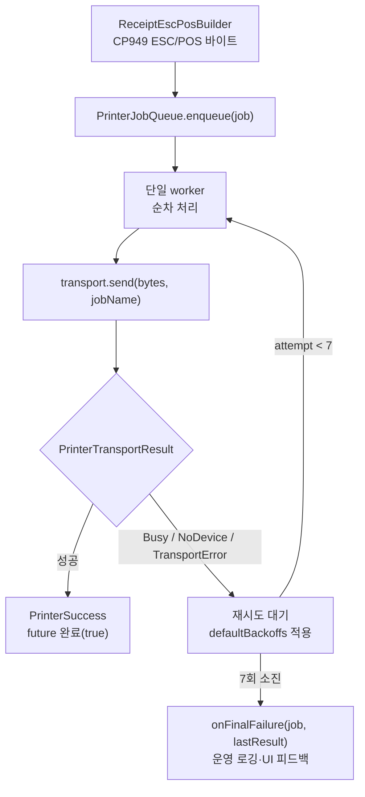
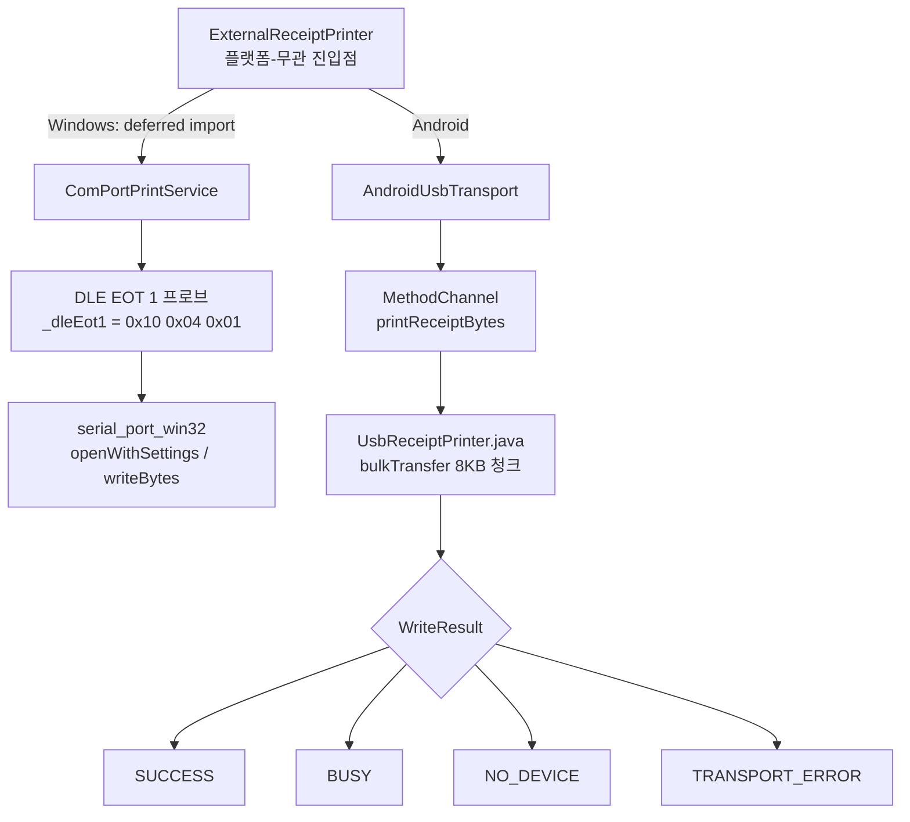
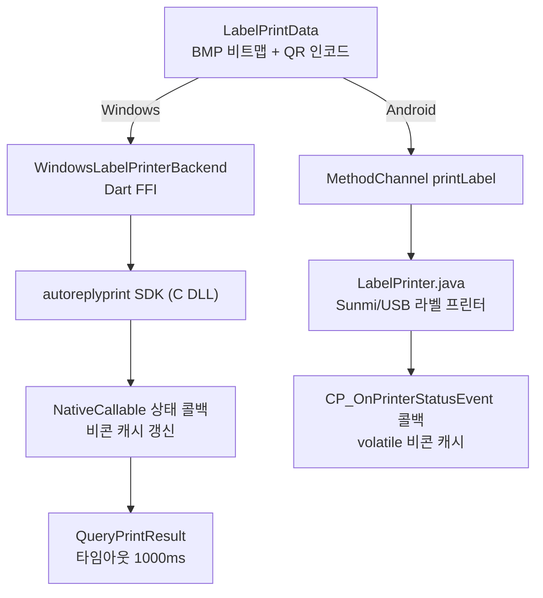
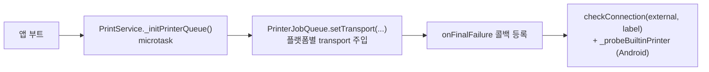

# 출력/프린터 계층 (Printer & Output Flow)

영수증·라벨 출력 경로를 도식화한 문서다. 매장 환경의 일시적 장애(POS 점유, USB 재연결, 느린 부팅)를
**큐 + 지수 백오프**로 흡수하고, **플랫폼별 transport**(Windows COM / Android USB)와 **라벨 FFI**로 분기한다.
주문 흐름과의 접점은 [docs/ORDER_FLOW.md](ORDER_FLOW.md) §6 참고.

> 한 줄 요약: **빌드(ESC/POS) → ExternalReceiptPrinter → PrinterJobQueue(백오프 재시도) → Transport(COM/USB) → 결과 분기 → 최종 실패 콜백**.
> 단일 출력 디바이스에 대한 동시 접근을 큐로 직렬화하고, 결과를 4종으로 분류해 재시도/포기를 판정한다.

---

## 1. 출력 큐 & 지수 백오프

**백오프 타임라인** ([printer_job_queue.dart](../lib/services/printer_job_queue.dart) `defaultBackoffs`)

| 시도 | 1 | 2 | 3 | 4 | 5 | 6 | 7 |
| --- | --- | --- | --- | --- | --- | --- | --- |
| 대기 | 즉시 | 2s | 5s | 10s | 20s | 40s | 60s |

- 총 7회, 누적 약 137초. 인덱스 0은 첫 시도(즉시), 1~6이 실제 백오프.
- `PrinterFinalFailureCallback = void Function(PrinterJob job, PrinterTransportResult lastResult)` — 최대 시도 초과 시 호출.
- 테스트는 `backoffsForTest` setter로 지연을 단축.

---

## 2. Transport 플랫폼 분기

**결과 4종** ([printer_transport.dart](../lib/services/printer_transport.dart))

| 타입 | 의미 | 재시도 |
| --- | --- | --- |
| `PrinterSuccess` | 출력 성공 | — |
| `PrinterBusy(reason)` | 디바이스 점유(POS 등) | O |
| `PrinterNoDevice(reason)` | 디바이스 없음/미연결 | O |
| `PrinterTransportError(reason)` | 전송 실패 | O |

- **Windows deferred import**: `serial_port_win32`의 정적 initializer가 Android 런타임에서 `kernel32.dll`을 찾으려다 크래시하는 것을 막기 위해 Windows transport를 지연 로드.
- **DLE EOT 1 프로브**: USB-Serial CDC 칩이 프린터 전원 OFF에도 bus power로 살아 있어 발생하는 false-positive("연결됨" 오판)를 차단. `_probeTimeout`(300ms), `_probeMaxAttempts`(5) 등으로 생존을 직접 확인 — 자세한 권위 판정은 메모리 `external_printer_liveness` 참조.
- **Android VID 화이트/블랙리스트**: Posbank(0x1552)·NXP(0x0D28) 허용, ASIX Ethernet(0x0B95) 제외. 청크 `CHUNK_SIZE` 8KB, 타임아웃 5000ms.

---

## 3. 라벨 프린터

- **Windows**: `WindowsLabelPrinterBackend`(싱글턴)가 AutoReplyPrint SDK를 FFI로 직접 호출. Java 패턴 1:1 포팅, `NativeCallable.listener`로 상태/완료 콜백 처리. `QueryPrintResult` 타임아웃 1000ms(구 3000ms→50장 부하에서 누적 지연 개선). 라벨 모드는 포트 닫힐 때까지 유지(매 라벨 재진입 방지).
- **Android**: MethodChannel `printLabel` → `LabelPrinter.java`. 인자 `autoReplyMode`/`useFeedToTear`/`useBackToPrint`/`useCalibrate`/`orderNo`/`labelIndex`/`totalLabels`.
- **QR 페이로드**: `qrPayloadStrategyProvider`가 브랜드별 전략 선택(현재 모두 `DefaultQrPayloadStrategy` = `{OrderNo}-{ShopItemId}-{CupIdx}`). 자세한 흐름은 [docs/BRAND_I18N_FLOW.md](BRAND_I18N_FLOW.md).
- FFI Isolate boxing·hot-reload 주의는 메모리 `ffi_isolate_boxing`, `hot_reload_cold_restart` 참조.

---

## 4. PrintService 초기화·연결 점검

- 앱 시작 시 transport를 큐에 주입하고 `onFinalFailure`를 등록해 최종 실패를 운영 로깅·UI로 노출.
- `checkConnection`이 외부/라벨/내장 프린터 상태를 갱신(`printerStatusProvider`, `builtinPrinterAvailableProvider`).

---

## 5. 핵심 파일 색인

| 파일 | 역할 |
| --- | --- |
| [printer_job_queue.dart](../lib/services/printer_job_queue.dart) | 출력 큐·지수 백오프(`defaultBackoffs`)·`onFinalFailure` |
| [printer_transport.dart](../lib/services/printer_transport.dart) | `PrinterTransportResult` 4종, `AndroidUsbTransport` |
| [external_receipt_printer.dart](../lib/services/external_receipt_printer.dart) | 플랫폼-무관 진입점, Windows deferred 로드 |
| [external_receipt_printer_windows.dart](../lib/services/external_receipt_printer_windows.dart) | Windows COM transport(deferred) |
| [com_port_print_service.dart](../lib/services/com_port_print_service.dart) | COM 포트·DLE EOT 1 프로브·`serial_port_win32` |
| [receipt_escpos_builder.dart](../lib/services/receipt_escpos_builder.dart) | CP949 ESC/POS 바이트 빌드 |
| [print_service.dart](../lib/services/print_service.dart) | transport 주입·연결 점검·MethodChannel 호스트 |
| [windows_label_printer_backend.dart](../lib/services/label_printer/windows/windows_label_printer_backend.dart) | 라벨 Windows FFI 백엔드 |
| [qr_payload_strategy.dart](../lib/services/label_printer/qr_payload_strategy.dart) | 라벨 QR 페이로드 브랜드 전략 |
| [UsbReceiptPrinter.java](../android/app/src/main/java/co/kr/waldlust/order/receive/util/print/UsbReceiptPrinter.java) | Android USB bulkTransfer·`WriteResult` |
| [LabelPrinter.java](../android/app/src/main/java/co/kr/waldlust/order/receive/util/print/LabelPrinter.java) | Android 라벨 프린터 |
