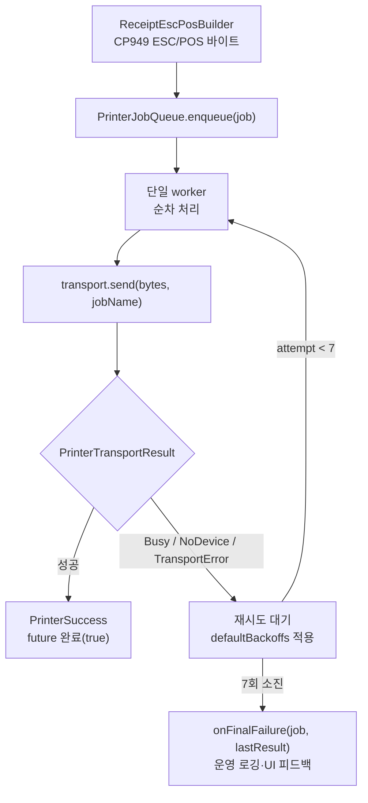
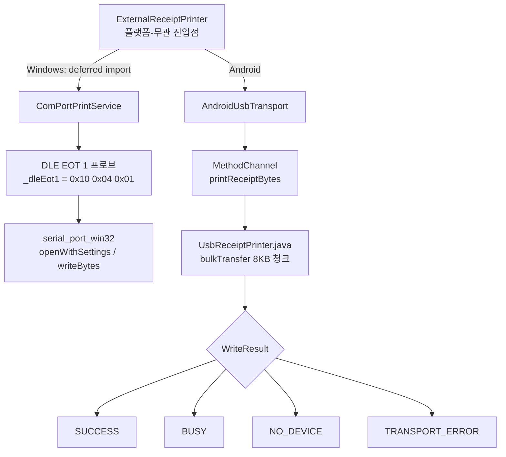
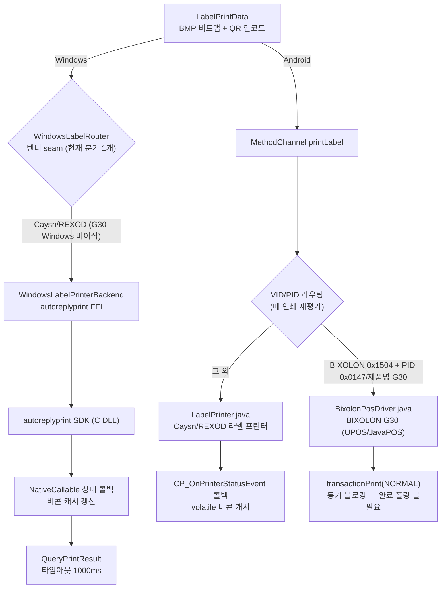
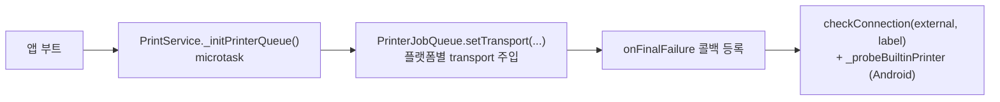

# 출력/프린터 계층 (Printer & Output Flow)

영수증·라벨 출력 경로를 도식화한 문서다. 매장 환경의 일시적 장애(POS 점유, USB 재연결, 느린 부팅)를
**큐 + 지수 백오프**로 흡수하고, **플랫폼별 transport**(Windows COM / Android USB)와 **라벨 FFI**로 분기한다.
주문 흐름과의 접점은 [docs/ORDER_FLOW.md](ORDER_FLOW.md) §6 참고.

> 한 줄 요약: **빌드(ESC/POS) → ExternalReceiptPrinter → PrinterJobQueue(백오프 재시도) → Transport(COM/USB) → 결과 분기 → 최종 실패 콜백**.
> 단일 출력 디바이스에 대한 동시 접근을 큐로 직렬화하고, 결과를 4종으로 분류해 재시도/포기를 판정한다.

---

## 1. 출력 큐 & 지수 백오프



**백오프 타임라인** ([printer_job_queue.dart](../lib/services/printer_job_queue.dart) `defaultBackoffs`)

| 시도 | 1 | 2 | 3 | 4 | 5 | 6 | 7 |
| --- | --- | --- | --- | --- | --- | --- | --- |
| 대기 | 즉시 | 2s | 5s | 10s | 20s | 40s | 60s |

- 총 7회, 누적 약 137초. 인덱스 0은 첫 시도(즉시), 1~6이 실제 백오프.
- `PrinterFinalFailureCallback = void Function(PrinterJob job, PrinterTransportResult lastResult)` — 최대 시도 초과 시 호출.
- 테스트는 `backoffsForTest` setter로 지연을 단축.

---

## 2. Transport 플랫폼 분기



**결과 4종** ([printer_transport.dart](../lib/services/printer_transport.dart))

| 타입 | 의미 | 재시도 |
| --- | --- | --- |
| `PrinterSuccess` | 출력 성공 | — |
| `PrinterBusy(reason)` | 디바이스 점유(POS 등) | O |
| `PrinterNoDevice(reason)` | 디바이스 없음/미연결 | O |
| `PrinterTransportError(reason)` | 전송 실패 | O |

- **Windows deferred import**: `serial_port_win32`의 정적 initializer가 Android 런타임에서 `kernel32.dll`을 찾으려다 크래시하는 것을 막기 위해 Windows transport를 지연 로드.
- **DLE EOT 1 프로브**: USB-Serial CDC 칩이 프린터 전원 OFF에도 bus power로 살아 있어 발생하는 false-positive("연결됨" 오판)를 차단. `_probeTimeout`(300ms), `_probeMaxAttempts`(5) 등으로 생존을 직접 확인 — 자세한 권위 판정은 메모리 `external_printer_liveness` 참조.
- **Android VID 화이트/블랙리스트**: Posbank(0x1552)·NXP(0x0D28) 허용, ASIX Ethernet(0x0B95) 제외. 청크 `CHUNK_SIZE` 8KB, 타임아웃 5000ms.

### 2.1 Windows 시리얼: 두 연결 형태 · 기본 보레이트 · serial_port_win32 함정

Windows COM 경로는 **두 가지 물리 연결을 동일 코드로 지원**한다 (2026-07 PR800 + NEXT-340PL COM6 실기 검증).

| 연결 형태 | 드라이버 | 특성 |
| --- | --- | --- |
| 프린터 내장 USB → USB-CDC 가상 COM (현장 표준) | usbser.sys 계열 | baud 무시, DSR/CTS 미전달(0x00), 무효 DCB도 관대하게 수용 |
| USB-RS232 어댑터(NEXT-340PL/PL2303 등) → 프린터 시리얼 포트 | ser2pl.sys 등 | DCB 검증 엄격, DSR/CTS 전달(0x30), 실제 wire 속도 존재(9600≈1KB/1.2s) |

**기본 보레이트 115200**: PR800 시리얼 포트 고정값(9600~57600은 DLE EOT 무응답, 115200만 0x16 응답). CDC는 baud를 무시하므로 전 연결타입 공통 기본값으로 안전. prefs 저장값이 항상 우선이며, 기본값 3지점은 함께 유지할 것 — `ComPortPrintService.defaultBaudRate` / `PreferenceService.getComPortBaudRate` / `ExternalPrinterSubSettings._defaultBaudRate`.

**serial_port_win32(1.4.2) 함정과 대응** (구현·근거 정본은 [com_port_print_service.dart](../lib/services/com_port_print_service.dart) 주석):

1. `openWithSettings`의 `StopBits`는 **DCB raw 값(0=1비트, 1=1.5비트, 2=2비트)**. 1을 넘기면 8데이터비트와 무효 조합이 되어 PL2303이 SetCommState에서 거부(open throw). CDC가 관대해 오래 잠복했던 버그 — 반드시 0 사용.
2. 패키지는 DCB를 zero-init 상태로 SetCommState 한다 → `_primeDcb`가 DCBlength/fBinary/Xon≠Xoff + DTR/RTS ENABLE을 선채움.
3. 패키지 open()이 CreateFile 후 SetCommState 등에서 throw 하면 **핸들을 누수**한다(이후 모든 재시도가 ACCESS_DENIED 락아웃). `_recoverLeakedHandle`이 openWithSettings throw 직후에만 회수 — 다른 시점 호출 금지(double-close 위험, 헬퍼 주석 참조).
4. `writeBytesFromUint8List`의 timeout은 시간이 아닌 **루프 반복 횟수**(unawaited delay 결함) → 실제 시리얼에서 write가 pending이기만 해도 false 반환. **write false ≠ 실패 확정** — probe는 RX 응답으로만 판정하고, 데이터 write 후 drain delay(전송시간+200ms)가 조기 close 잘림을 방지.
5. open 직후 `EscapeCommFunction(SETDTR/SETRTS)` assert — DTR/DSR 흐름제어 프린터가 host not-ready로 수신/응답을 보류하는 것을 방지.

**시리얼 무응답 트러블슈팅 순서**: ① COM enumerate 확인(케이블/드라이버) → ② open throw면 위 1·2(DCB) 의심 → ③ probe-timeout이면 보레이트 스윕(115200 우선) → 프린터 전원 → 배선(널모뎀) 순으로 분리. DLE EOT 1(`0x10 0x04 0x01`)의 정상 온라인 응답은 `0x16`.

---

## 3. 라벨 프린터



- **지원 기종은 2종**: **REXOD RXLA-561**(Caysn autoreplyprint SDK, 갭 라벨) + **BIXOLON G30**(UPOS/JavaPOS SDK, 연속 용지). Caysn D2/D3 는 화이트리스트에 남아 있으나 판매 모델은 아니다. BIXOLON XD5-40d 지원은 2026-09 종료 — §3.4 참조.
- **Windows**: `WindowsLabelRouter`는 지금 분기가 하나뿐이지만 **벤더 seam 으로 의도적으로 유지**한다(G30 Windows 이식 시 두 번째 분기가 그 자리에 들어온다 — §3.5 "남은 작업"). 실제 출력은 `WindowsLabelPrinterBackend`(AutoReplyPrint SDK FFI, Java 패턴 1:1 포팅, `NativeCallable.listener` 상태/완료 콜백, `QueryPrintResult` 타임아웃 1000ms, 라벨 모드는 포트 닫힐 때까지 유지). Android 와 동일한 에러 의미론(복구대기·submit-wins) 공유. **G30 은 Windows 미이식** — 꽂아도 Caysn 화이트리스트에 걸러져 인쇄되지 않는다.
- **Android**: MethodChannel `printLabel` → `NativeMethodHandler` 가 연결된 USB VID/PID 로 벤더 분기 — **G30(VID 0x1504 + PID 0x0147, 또는 제품명 "G30")을 먼저 체크**하고(`BixolonPosDriver.isG30Attached`), 나머지는 `LabelPrinter.java`(Caysn autoreplyprint). G30 판정은 **좁다** — VID 만 맞는 미식별 BIXOLON 기기는 Caysn 화이트리스트에 걸러져 **어느 드라이버로도 인쇄되지 않는다**(XD5-40d 종료로 0x1504 의 폴백 대상이 없어졌고, 이는 의도된 동작이다). G30 은 UPOS/JavaPOS SDK(`com.bxl.**`/`jpos.**`) 기반이고 `setAsyncMode(false)` 동기 모드라 `transactionPrint(PTR_TP_NORMAL)` 자체가 물리 인쇄 완료까지 블로킹하므로 Caysn 처럼 별도 완료 폴링 루프가 없다. 인자 `autoReplyMode`/`useFeedToTear`/`useBackToPrint`/`useCalibrate` 는 Caysn 전용(G30 경로는 전부 무시), `orderNo`/`labelIndex`/`totalLabels` 는 공통. 두 드라이버 모두 동일한 에러 의미론 공유: 용지없음/커버열림=무한 복구대기, 기타 에러=0.5s 게이트 후 false(Dart 재시도), 전송 완료 후는 submit-wins(중복 인쇄 방지) — G30 은 `PTR_TP_TRANSACTION`(버퍼링)→`PTR_TP_NORMAL`(flush)이 그 경계.
- **QR 페이로드**: `qrPayloadStrategyProvider`가 브랜드별 전략 선택(현재 모두 `DefaultQrPayloadStrategy` = `{OrderNo}-{ShopItemId}-{CupIdx}`). 자세한 흐름은 [docs/BRAND_I18N_FLOW.md](BRAND_I18N_FLOW.md).
- FFI Isolate boxing·hot-reload 주의는 메모리 `ffi_isolate_boxing`, `hot_reload_cold_restart` 참조.

### 3.1 Android / Windows 동작 차이 전수 (통일 시 참조)

두 백엔드는 **에러 의미론과 결과 계약(3분류)은 같지만 명령 순서와 대기 시점이 다르다.**
"Windows 는 이 증상이 없다" 를 근거로 쓸 때 어느 차이가 작용했는지 구분하지 않으면 오판한다.

| # | 항목 | Android `LabelPrinter.java` | Windows `windows_label_printer_backend.dart` |
|---|---|---|---|
| ① | feedToTear 위치 | `PagePrint` → **`FeedPaperToTearPosition`** → `QueryPrintResult` (**ACK 대기 창 안**) | ACK 확정 → 떼기 대기 → **그 다음** `labelFeedLabel` (창 밖) |
| ② | 떼기 대기 시점 | 완료 신호가 없을 때만. 성공 시 **안 기다리고 반환** | **동일** ✓ (2026-08-07 통일 — 이전에는 매 인쇄마다 반환 전에 `_waitPaperFetched`) |
| ③ | ACK 획득 방식 | `QueryPrintResult`(2초 슬라이스) + **PAPERNOFETCH 상승 edge**, 먼저 오는 쪽. 총 상한 30초 | printed 콜백 + **PAPERNOFETCH 상승 edge** 폴링, `QueryPrintResult` 는 fallback |
| ④ | `useCalibrate` | 매 라벨마다 `CP_Label_CalibrateLabel` | **의도적 무시** (매 라벨 호출 시 갭센서 정렬로 텀 급증 — 50장 부하 검증). 기본값 `false` 라 현재 실피해 없음 |
| ⑤ | 라벨 간 300ms | `index > 0 && Platform.isAndroid` (`output_service.dart`) | 없음 |
| — | 에러 게이트 / idle 게이트 / 결과 계약 | paper·cover 무한 대기, 그 외 500ms, idle 5000ms, 3분류 | **동일** ✓ |

**②가 운영자 체감 차이를 만들었다 — Android 는 비프음이 울리는데 Windows 는 안 울렸다.**
Android 는 앞 라벨을 안 뗀 상태로 다음 `PagePrint` 를 펌웨어에 보내고, 펌웨어가 buzzer 를
울리며 보류한다(`INFO_PAPERNOFETCH` 를 진입 게이트에서 **의도적 제외**한 결과). Windows 는
인쇄 호출 안에서 떼기까지 블로킹해 다음 `PagePrint` 가 애초에 펌웨어에 닿지 않았다.
**2026-08-07 에 Windows 를 Android 에 맞춰 해소했다** (아래 §3.3).

2026-08-07 실기기(D2s_KDS_STGL + REXOD RXLA-561) 확인:

```
09:07:53.155 #2 [0005] 출력시작
09:07:53.593 #2 [0005] 떼기대기 (PAPERNOFETCH, buzzer 활성)   ← 앞 라벨 안 뗌
```

> **통일 방향 원칙 — Android 쪽으로 맞춘다.** ②를 *Windows 기준*으로 맞추면(= Android 에
> PAPERNOFETCH 선행 게이트 추가) **비프음이 조용히 사라진다.** 비프음은 버그가 아니라 점주
> 알림 기능이다. 불변식: **"떼지 않은 상태에서 다음 `PagePrint` 가 펌웨어에 도달한다."**
> ③은 완전히 통일하지 않는다 — D2s_KDS_STGL 에서 printed 콜백이 fire 0건이라(2026-05-04
> 부하 테스트) 기기 제약에서 온 divergence다. 다만 Android 도 `QueryPrintResult` 단일 의존을
> 벗어나 **PAPERNOFETCH 상승 edge** 를 독립 완료 신호로 함께 쓰면서 Windows 의 다중 신호
> 구조에 한 걸음 가까워졌다. 계약(3분류)은 원래부터 같다.

### 3.2 Android 완료 판정 — 왜 다중 신호인가 (2026-08-07)

`CP_Pos_QueryPrintResult` **하나에만** 완료 판정을 걸면, 응답이 유실됐을 때 라벨이 이미
나왔고 프린터가 놀고 있는데도 30초를 태운 뒤 "모르겠다"로 끝난다. 新橋店 2026-08-07 로그의
`#40` 이 그 경우다 — `recvIdle=true printIdle=true`(프린터 idle) + 페이지 카운터 증가 +
비콘 생존인데 응답만 오지 않았다.

그래서 대기를 2초 슬라이스로 쪼개고 `QueryPrintResult` 와 **PAPERNOFETCH 상승 edge** 중
먼저 오는 쪽으로 완료를 판정한다. **총 상한 30초는 유지**한다(줄이면 미인쇄 페이지를 넘겨
펌웨어 버퍼에 쌓인다). 바꾼 것은 상한이 아니라 판정 근거의 개수다.

**edge 여야 하는 이유**: 앞 라벨이 안 떼어져 있으면 PAPERNOFETCH 레벨은 이미 true 라
"내 라벨이 나왔는가"를 구별할 수 없다. 보류에서도 edge 는 반드시 생긴다 —
앞 라벨 peel(true) → 운영자가 뗌(false) → 붙잡힌 페이지 인쇄(true).

**인쇄 매수(pageId)는 신호로 쓰지 않는다.** 같은 호출 안에서는 절대 갱신되지 않고
(로그 199건 중 0건) 다음 인쇄 시점에야 반영돼, 앞 페이지의 뒤늦은 등록을 내 페이지로
오인할 수 있다. 진단 로그에만 남긴다.

> ⚠️ **펌웨어 보류는 이 변경으로 빨라지지 않는다.** 앞 라벨을 안 떼면 펌웨어가 실제로
> 인쇄를 안 하는 것이라 그 시간은 낭비가 아니다. 그리고 **라벨을 늦게 떼는 것은 러시아워의
> 정상 운영**이지 고칠 대상이 아니다. 이 루프가 고치는 것은 보류가 아니라 "이미 나왔는데
> 응답이 없는" 경우다. 기대효과를 보류 건수로 계산하지 말 것.

실기기 실측(D2s_KDS_STGL `DK1925AJ40349` + REXOD, 2026-08-07):

| 상황 | 결과 |
|---|---|
| 정상 | `출력끝 (1213ms, via=query, ack=900ms)` — 슬라이싱해도 응답 유실 없음, 회귀 없음 |
| 보류 → 떼기 | `출력끝 (12645ms, via=peel, ack=12515ms)` — edge 발생 **481ms** 만에 완료 |
| 계속 안 뗌 | 30.2초에 `떼기대기 (buzzer 활성)` 전환 — 폴백·비프음 정상 |

완료 판정 근거(`프린터응답` / `라벨나옴`)를 로그에 남겨 신호별 기여도를 셀 수 있게 했다.
관측 불가한 가드를 남기지 않기 위한 장치다.

### 3.3 Windows 비프음 복원 (2026-08-07)

Windows `_printOnce` 는 **성공 경로에서** `_waitPaperFetched` 로 떼기까지 블로킹한 뒤에야
반환했다. 그래서 다음 `PagePrint` 는 peel 이 비워진 뒤에야 나가고, 펌웨어는 buzzer 를 울릴
계기를 얻지 못했다. 완료 신호를 받으면 **떼기를 기다리지 않고 반환**하도록 바꿔 해소했다.

**비프음만 따로 고칠 수 없었다.** 완료 폴링이 `paperNoFetch` 를 **레벨**로 검사하고 있었는데,
그 레벨 검사는 위 떼기 대기가 "인쇄 시작 시 peel 은 늘 비어 있다" 를 보장해 준 덕에 우연히
맞아떨어지던 것이었다. 대기를 걷어내면 앞 라벨이 남은 채로 인쇄가 시작되고, 레벨은 이미
true 라 **아직 나오지도 않은 라벨을 첫 폴링에서 완료로 판정**하게 된다. 그래서 Android 와
동일하게 **상승 edge** 로 바꿨다(`_paperNoFetchRiseCount`).

> ⚠️ 이 edge 카운터는 `_resetStatusBeacon` 에서 **리셋하지 않는다.** 절대값은 의미가 없고
> 인쇄 전후 델타만 쓰는 단조 카운터인데, 0 으로 되돌리면 `riseBefore` 가 0 보다 클 때
> `!=` 비교가 "변했다" 로 읽혀 인쇄되지 않은 라벨을 완료로 판정한다.

폴링 예산(1700ms)과 fallback `QueryPrintResult`(1000ms)는 그대로 두었다. 보류는 그 뒤의
무한 떼기 대기가 받으므로 예산을 늘릴 이유가 없고, 늘리면 오히려 폴백 도달만 늦어진다.
`labelFeedLabel` 도 ACK 확정 **뒤** 라는 현재 위치를 유지한다 — 공유 USB IN 엔드포인트에
명령을 얹지 않는 Windows 의 좋은 성질이다(Android 는 이 명령이 ACK 대기 창 안에 있다).

**BIXOLON 경로는 이 커밋에서 건드리지 않았다.** `takenWait` 동안 대기하는 같은 모양이지만
벤더·펌웨어가 달라 buzzer 동작이 미검증이었다. 당시 BIXOLON 경로는 XD5-40d 였고, 그 기종은
2026-09 지원 종료됐다(§3.4) — 여기 남은 결론은 **Caysn/REXOD 경로에 대한 것**이다.

#### 실기기 검증 (Windows POS, 2026-08-07)

3장짜리 주문 재출력, **라벨을 바로바로 떼면서**:

```
[Label][0001 1/3] 출력끝 (529ms, 라벨나옴) 연결=정상
[Label][0001 2/3] 출력끝 (1019ms, 라벨나옴) 연결=정상
[Label][0001 3/3] 출력끝 (1272ms, 라벨나옴) 연결=정상
```

**비프음 정상 발생.** 중복 없음, 보류 없음. 0.5~1.3초로 Android(~1.2초)와 동등하거나 빠르다.
(첫 인쇄 1회만 3329ms — warm-up 이고 이후 정상.)

라벨을 **안 뗀 채** 요청한 경우:

```
[Label][0001 2/3] 떼기대기 (앞 라벨을 안 뗌 — 비프음 울림)
[Label][0001 2/3] 떼어짐 (대기 12900ms)
[Label][0001 2/3] 출력끝 (16378ms, 떼기대기) 연결=정상
```

두 가지를 기록해 둔다:

- **완료 판정은 전부 `라벨나옴`(peel edge)이었고 `프린터응답`(printed 콜백)은 한 번도 이기지
  못했다.** 설계 시에는 Windows 의 주 신호가 printed 콜백이라고 봤으나 실측은 반대다.
  바꿔 말하면 **edge 신호가 없으면 이 경로는 매번 fallback 질의까지 내려간다** — 레벨을
  edge 로 바꾼 것이 비프음 복원의 부수 작업이 아니라 이 경로의 주 신호가 된 셈이다.
- 한 주문 안의 라벨은 ~0.5초 간격이라 **2번째부터는 거의 항상 비프음이 난다.** 그 사이에
  떼는 것은 물리적으로 불가능하기 때문이며, 바로 떼면 보류 없이 이어져 지연은 0 이다.
  Android 도 동일하다(라벨 간 300ms 딜레이가 있어도 마찬가지).

> ⚠️ `떼기대기` 로 끝난 경우 완료 보고 시점이 **한 박자 이르다** — 앞 라벨이 떼어진 순간
> 반환하고, 정작 자기 라벨은 그 직후 나온다. Android 의 같은 분기와 맞춘 것이고 중복·누락을
> 만들지는 않지만(다음 인쇄의 idle 게이트가 흡수), 떼어진 직후 용지 소진 등으로 펌웨어가
> 인쇄에 실패하면 조용히 놓칠 수 있는 틈이 남아 있다. 양 플랫폼 공통 과제.

### 3.4 BIXOLON XD5-40d 지원 종료 (2026-09-01)

XD5-40d 기종 지원을 종료하면서 이 절(Android 완료 판정 재설계, 2026-08-07)의 본문을
삭제했다. 지원 대상은 REXOD RXLA-561 + BIXOLON G30 두 기종이다.

지워진 것: `BixolonLabelDriver.java`(Label SDK/SLCS 드라이버) · `BixolonLabelPrinterLibrary_V2.1.1.jar` ·
Windows BXLLAPI FFI 스택 5개 파일 + `BXLLAPI_x64.dll` 번들.
**남은 BIXOLON 자산(`libbxl_common.so` · `libcommon` jar · `com.bixolon.pdflib` 스텁 ·
proguard `com.bixolon.**` keep)은 전부 G30 소유다** — XD5 잔재로 보고 지우면 안 된다
(메모리 노트 `project_bixolon_xd5_removal_residue.md`).

**절 번호는 비워 둔다** — 메모리 노트가 "§3.5(40mm)·§3.6(58mm)" 을 명시 인용하고 있어
재번호를 매기면 그 포인터가 끊기는 게 아니라 엉뚱한 절로 해소된다.

살아남은 결론 2가지:
- **사전 이진화 임계 210** — SDK 자체 이진화가 저임계로 동작해 얇은 요소가 소실되는
  문제. G30 이 `BixolonPosDriver.BINARIZE_THRESHOLD` 로 승계했고, **그 javadoc 이 레포에
  남은 유일한 근거 사본**이다(Windows 복제본 2곳은 함께 삭제됨).
- **BIXOLON SDK 에 buzzer API 는 없다** — `libcommon`(135클래스)·`libbxl_common.so` 심볼
  전수 조사 결과. 두 자산 모두 G30 과 공유하므로 이 조사는 **G30 에도 유효하고 재조사가
  불필요**하다. 단 XD5 의 "버저 하드웨어 미탑재" 결론은 개별 하드웨어 사실이라 G30 으로
  승계되지 않는다(G30 실기기 확인 미실시).

### 3.5 BIXOLON G30 (UPOS) — 신규 기종 통합 + 40mm 연속용지 레이아웃 (2026-08-21)

갭 라벨 기종(Caysn D2/D3, REXOD RXLA-561)은 고정 크기 낱장이라 490×600 고정 캔버스
PNG 한 장이면 됐다. G30 은 **연속 용지 + 커터**라 그 전제가 깨진다 — 세로 가변 레이아웃이
필요하고, SDK 도 완전히 다르다(UPOS/JavaPOS, `BixolonPosDriver.java` — §3 도입부 참조).

**렌더링 방식**: 비트맵 확정(네이티브 텍스트 아님). 근거는 ① `printBitmap`/NV이미지 모두
자기 래스터 라인을 점유해 목업의 "헤더 한 줄(로고+날짜+n/N)" 구조가 구조적으로 불가능
② 1차 대상 매장이 일본어라 SDK 내장 폰트 ROM 의 일본어 지원이 미검증 위험 ③ Windows
이식 시 명령셋을 또 짜지 않아도 됨(BMP 경로 재사용) ④ QR 은 기존 `LabelDrawOps.drawCrispQr`
(정수픽셀+AA off)로 이미 네이티브 하드웨어 QR과 동등 품질이라 네이티브의 유일한 이점이 없음.

**레이아웃 구현**: `ContinuousLabelPainter`(신규, `lib/utils/continuous_label_painter.dart`)가
목업 순서(헤더→표시번호→QR→서브정보→메뉴명→옵션→구분선→메모)로 그리고, `paintAndMeasure`
가 콘텐츠 하단 Y 를 반환 → `Picture.toImage(w, h)` 로 필요한 높이만 1-pass 래스터화(2-pass
불필요). 저수준 draw 프리미티브(`drawText`/`drawAutoFitText`/`fitFontSize`/`drawCrispQr`/로고
캐시)는 `LabelDrawOps` mixin(신규, `lib/utils/label_draw_ops.dart`)으로 뽑아 기존
`LabelPainter`(490×600)와 공유 — Dart 프라이버시가 파일 단위라 언더스코어를 뗀 순수 이동.
용지 규격은 `LabelMediaSpec`(신규, `lib/services/label_printer/label_media_spec.dart`) 값
객체로 캔버스 폭/높이/좌우여백을 기종별로 분리(`gap490x600`은 기존 상수 그대로 — 갭 라벨
기종 회귀 0, `continuous40`이 G30).

#### 실기기 기하 확정 — 시행착오 기록

여러 차례 실기기 왕복 끝에 도달한 결론이라 **다음에 58mm 를 잡을 때 같은 시행착오를 반복하지
않도록** 순서대로 남긴다.

1. `getRecLineWidth()`=576dots 는 헤드 물리 최대폭(≈72mm)이지 로드된 용지 폭이 아니다 —
   40mm/58mm 는 용지 장착 시 끼우는 가이드 부품으로 고정되는 구조라 SDK 가 자동보고하지 않는다.
2. `PTR_BM_CENTER` 정렬은 이 기기/펌웨어에서 **백지 출력**을 일으킨다(재현 확인) — `PTR_BM_LEFT`
   확정.
3. 임시로 만든 "눈금자 테스트"(0~40mm 눈금 + L/R 마커를 인쇄해 실물에서 mm 단위로 읽는 진단
   이미지, `ContinuousLabelPainter.generateRulerTestImage` — 계산이 끝나 현재는 제거됨)로
   실측한 결과: **인쇄 가능 영역은 항상 정확히 35mm(280dot)** — 좌우 margin 을 12/12, 48/48,
   4/48 등 여러 조합으로 바꿔봐도 잘리는 경계는 매번 35mm 로 동일했다(3회 재현).
4. **핵심 발견**: margin(좌측 padding)을 키워서 콘텐츠를 시각적으로 중앙에 맞추려는 시도는
   전부 실패했다 — 오히려 키울수록 그만큼 그대로 더 오른쪽으로 밀렸다. 원인은 **인쇄 시작
   위치 자체가 하드웨어에 고정**돼 있어서다 — padding 을 0.5mm 로 최소화한 상태에서도 "인쇄
   자체가 이미 왼쪽 공백이 있는 상태로 시작"하는 게 실물에서 확인됐다. 즉 소프트웨어가 보내는
   비트맵 안에 여백을 아무리 재배치해도 그 시작 위치는 움직이지 않는다 — **시각적 중앙 정렬은
   이 기종/이 용지 조합에서 소프트웨어 영역 밖**이다(용지 가이드 재장착 등 하드웨어 쪽이 남은
   유일한 레버).
5. 그래서 접근을 바꿨다 — "40mm 캔버스 + margin 으로 중앙 맞추기" 대신 **캔버스 자체를 실측
   유효 인쇄폭(272dot, 35mm 경계 대비 8dot 여유)으로 좁히고, 좌우 margin 은 "잘리지 않는 최대
   폭 확보"용으로만 쓴다.** 최종값(`LabelMediaSpec.continuous40`): `widthDots=272`,
   `sideMarginDots=0`(좌 — 하드웨어가 이미 여백을 두고 시작하므로 소프트웨어가 더 얹는 건
   중복), `rightMarginDots=16`(우 — 콘텐츠가 캔버스 우측 끝에 바짝 붙어 보인다는 실물 피드백
   으로 좌보다 크게).

QR 겹침처럼 보였던 버그 두 건도 이 과정에서 같이 잡혔다 — `LabelDrawOps.drawCrispQr`의
quiet zone(모듈 4개 폭 흰 배경)이 `clampQuietTopTo`/`clampQuietBottomTo` 없이는 인접 요소
쪽으로 그냥 확장돼, 간격(gap)이 quiet zone 보다 좁으면 인접 텍스트를 흰색으로 덮어썼다(표시
번호/QR, QR/subInfo 양쪽 다 겪음) — QR 박스 안으로 clamp 하도록 고쳐 gap 크기와 무관하게
항상 안전하게 만들었다.

#### 남은 작업

- **Windows(BXLPAPI) 이식 — 미착수.** Android UPOS 와는 별도 명령셋(BXLPAPI). 레이아웃(PNG
  생성)은 `ContinuousLabelPainter`/`Continuous58LabelPainter`+`LabelMediaSpec`을 그대로 재사용
  가능 — 이식 대상은 순수 전송 계층뿐. 할 일 두 가지:
  ① `print_service.dart` 가 Windows 경로에 `LabelPainter.width/height`(490/600)를
  하드코딩하는 지점을 실제 생성 이미지 크기로 교체(연속용지는 세로 가변).
  ② `windows_label_router.dart` 에 **G30 분기를 신규 추가**(기존 하드코딩 수정이 아니다 —
  XD5-40d 의 `'BIXOLON XD5-40d'` 하드코딩은 §3.4 에서 이미 제거됐고, 라우터 파일은 바로
  이 분기가 들어올 자리로 남겨 둔 것이다). `connectedModelName` / `printPng` /
  `warmupOpen` 세 지점이 대상.

### 3.6 BIXOLON G30 — 58mm 연속용지 레이아웃 (2026-08-26)

40mm 과 **별개 레이아웃**이다(확대판이 아니다). 목업 기준 요소 배치가 다르다:

| | 40mm (`ContinuousLabelPainter`) | 58mm (`Continuous58LabelPainter`) |
| --- | --- | --- |
| 헤더 | 로고 좌 / 날짜 1줄 중앙 / n·N 우 | 날짜 **2줄 좌** / 로고 중앙 / n·N 우 |
| 표시번호·QR | 둘 다 중앙, 세로로 쌓임 | 번호 좌 + QR 우, **한 행에 나란히** |
| 서브정보 | 평문 1줄(원두/온도/사이즈 순) | **콘텐츠 폭 전체 검정 바 + 흰 굵은 글씨**(온도/사이즈/원두 순) |
| 옵션 | 1열 최대 5행 | **2열 최대 4행**(3개 이하는 1열), 초과 시 `+N` |

세로 가변 계약(`paintAndMeasure` → `Picture.toImage(w, h)` 1-pass)과 저수준 draw 프리미티브
(`LabelDrawOps`)는 40mm 과 공유한다. `continuous40` 및 갭 라벨 경로는 **한 줄도 건드리지 않았다.**

#### 폰트 크기는 목업 비율이 아니라 40mm 검증값에 맞췄다

목업 비례를 그대로 dot 으로 환산하면 메뉴명이 19dot 수준으로 나와 **40mm(26dot)보다 작아진다** —
넓은 용지가 오히려 덜 보이는 역전이라 채택하지 않았다. 목업은 배치·비례의 기준으로만 쓰고,
가독성이 걸린 폰트(메뉴명 26 / 옵션 20 / 메모 22)는 40mm 에서 실물 검증된 값을 그대로 가져왔다.

#### 선행 수정 — Java 전송폭 clamp 320 → 576 (이게 먼저여야 한다)

`BixolonPosDriver.printBitmap` 의 `Math.min(bitmap.getWidth(), 320)` 은 **40mm 물리 용지폭**을
상한으로 쓰고 있었다. 58mm 비트맵(320dot 초과)은 여기서 조용히 잘린다. 더 나쁜 것은 **눈금자
진단조차 항상 320dot 에서 끊겨 "58mm 유효폭 = 320dot" 이라는 가짜 실측값**을 만든다는 점이다 —
측정보다 이 수정이 앞서야 하는 이유. 상한을 헤드 물리 최대폭(`MAX_PRINT_WIDTH_DOTS = 576`,
`getRecLineWidth()` 보고값)으로 올렸다. 용지별 실제 인쇄폭은 Dart `LabelMediaSpec` 이 결정한다.

#### QR quiet zone 가로 clamp (`clampQuietLeftTo`/`clampQuietRightTo`)

40mm 에서 세로로 겪었던 겹침 사고의 **가로 버전**이 58mm 에서 그대로 재현되는 구조였다. QR 을
표시번호와 같은 행에 두면 quiet zone(모듈 4개 폭 흰 배경)이 QR 박스 밖으로 30dot 넘게 확장돼
바로 옆 표시번호의 끝자리를 흰색으로 지운다. `drawCrispQr` 에 좌우 clamp 를 추가해(기존 상하
clamp 와 대칭) QR 박스 안으로 가둔다 — 간격(gap)으로 막으려면 32dot 이상이 필요해 가로 폭이
아깝고, `modulePx` 에 따라 흔들리는 취약한 불변식이 된다.

#### 용지 사이즈 선택 배선

G30 은 한 대가 가이드 부품 교체만으로 40/58 을 겸용하는데 **SDK 가 로드된 용지 폭을 보고하지
않는다**(자동 감지 불가) — 매장이 고른 값이 유일한 근거다. `PreferenceService.KEY_LABEL_PAPER_SIZE`
(int mm, 기본 **40**)에 저장하고, 설정 화면의 "라벨 프린터 사용" 하위 설정에서 **G30 연결 시에만**
40mm/58mm 선택 버튼을 노출한다(다른 기종은 전부 고정 크기 갭 라벨이라 선택지를 보여주면 오설정을
유도한다). 기본이 40 이라 기존 매장은 아무것도 안 해도 종전 레이아웃 그대로다.
`output_service.dart` 와 개발자 옵션의 "테스트 출력(3장)" 이 **같은 분기**를 쓴다 — 자동출력과
다른 레이아웃이 나가면 그 버튼으로 하는 검증 자체가 무의미해지기 때문.

#### 실기기 기하 확정 — 유효 인쇄폭 52.5mm

개발자 옵션의 **"눈금자 테스트"** 버튼(`LabelRulerTestImage`, `label_ruler_test_image.dart`)으로
판독했다. 물리 용지폭 전체(464dot)를 캔버스로 잡아 폭 전체를 채우는 검정 바를 인쇄하므로 **잘리는
게 정상**이고, 어디서 잘리는지가 곧 측정값이다(5mm 교대 블록 스트립이 세기 보조).

| | 물리 용지폭 | 실측 인쇄 가능폭 | 손실 | 확정 `widthDots` |
| --- | --- | --- | --- | --- |
| 40mm | 320dot | 280dot (35mm) | 5mm | 272 |
| **58mm** | 464dot | **420dot (52.5mm)** | **5.5mm** | **412** |

손실이 두 용지에서 5mm / 5.5mm 로 거의 같다 — 용지 장착 가이드가 만드는 고정 오프셋이라는
§3.5 의 해석과 일관된다. **다만 이건 결과가 비슷했던 것이지 비례로 유도한 값이 아니다** —
비례 확대였다면 58×(35/40)=50.75mm 로 1.75mm(14dot) 어긋났고, 그만큼 콘텐츠가 손해였다.
`widthDots`=412 는 판독 경계 420 에서 8dot(1mm) 여유를 뺀 값으로, 40mm 이 280 경계에서 272 를
쓴 것과 같은 규칙이다. `test/services/label_media_spec_test.dart` 가 이 값을 고정한다 — 바꾸면
테스트가 실패해 근거(실측 판독)를 남기도록 강제한다.

#### 검정 반전 바 가독성 — 폰트 크기가 지렛대이지 stroke 가 아니다

1차 실기기 출력에서 흰 글씨 가독성이 떨어진다는 피드백을 받았다. 반전 인쇄의 흰 획은 **두 번
얇아진다** — ① threshold 210 이진화가 안티앨리어싱 경계를 검정으로 밀고 ② 감열지에서 주변 검정이
번져 들어온다.

Pretendard 는 **Bold(700)가 번들에 없어**(pubspec 이 Medium/Regular/SemiBold 만 선언 — Bold 추가는
APK +1.6MB) `FontWeight.w700` 을 줘도 w600 으로 폴백한다. 그래서 자산을 늘리지 않는 두 가지 수단만
남는다: 폰트 크기와 **의사 볼드(같은 색 stroke 를 깔고 fill 을 얹어 획을 부풀리는 것,
`LabelDrawOps.drawText` 의 `strokeWidth`)**.

threshold 210 이진화를 그대로 재현해 후보를 비교한 결과가 결정적이었다:

> **stroke 는 획을 굵게 하는 만큼 획 사이 간격도 같은 양만큼 좁힌다.** 획이 촘촘한 문자
> (한글 '블'/'없', 한자)에서는 counter(속빈 공간)가 먼저 메워져 글자가 흰 덩어리로 뭉개진다 —
> fs24 기준 `strokeWidth` **1.2 에서 이미 실패**했고 0.8 은 깨끗했다. 반면 **fontSize 는 획과
> 간격이 함께 커져** counter 를 잃지 않는다.

1차 결론: `subInfoFontSize` 20 → **24**, `subInfoBarHeight` 34 → **42**, `subInfoStrokeWidth`
**1.0**(검증된 깨끗한 0.8 과 실패한 1.2 사이 — 실제 감열 번짐은 시뮬레이션보다 획을 더 얇게
만들므로 0.8 보다 위를 택했다). **더 굵게 필요하면 stroke 가 아니라 fontSize 를 올릴 것.**

##### 재조정 — 헤더 확대 (2026-09-03)

날짜·주문순번을 **`headerFontSize` 17 → 24**(x1.41) 로 키우고, 헤더가 통째로 커지도록 같은
비율을 **`headerLogoSize` 40 → 56**, **`headerHeight` 46 → 65** 에 함께 적용했다. 셋은 하나로
묶인 값이라 따로 움직이면 깨진다 — 폰트만 키우면 날짜 2줄(24 x 1.193 x 2 = **57.3**)이 46 을
넘어 `(headerHeight - probe.height) / 2` 가 음수가 되면서 헤더 위로 밀려 나가고, 높이만 키우면
로고가 상대적으로 작아 보인다. 행높이 계수 1.193 은 Pretendard 실측(hhea ascender 1950 /
descender -494 / upem 2048)이다.

로고는 원본 BMP 가 50x50 이라 56 은 **nearest 확대(x1.12)** 가 된다 — 40 일 때의 축소
(50 -> 40, 행 10개 소실)보다 획 손실은 덜하지만 행 복제가 고르지 않아 인쇄물에서 거칠 수 있다.
그때 다음 후보는 원본과 1:1 인 50 이다. `filterQuality`는 `none` 유지 — 보간을 켜면 회색
픽셀이 생기고 threshold 210 이진화가 그걸 다시 검정으로 밀어 로고가 뭉친다.

##### 재조정 — 메뉴명 26 → 29 (2026-09-03)

실물에서 메뉴명이 서브정보 바에 눌린다는 판단으로 **`menuNameFontSize` 29**(+12%) 로 올렸다.
서브정보 쪽을 줄이는 방향(19·22)도 시험했지만 **`subInfoFontSize` 24 로 원복**했다 — 결국 손댄 건
메뉴명 하나뿐이고, 상대 비가 26:24 → 29:24 로 벌어져 **메뉴명이 라벨의 1순위 정보라는 위계**가
분명해진다. 메뉴명이 40mm(26)보다 커졌는데, 58mm 는 콘텐츠 폭이 272 → 412dot 이라 같은 글자 수가
더 짧은 줄을 차지하므로 이 확대를 감당한다.

시험 과정에서 확인한 규칙 — **`subInfoFontSize` 를 움직이면 `subInfoStrokeWidth` 도 같은 비율로
따라 움직여야 한다.** 위 실패 조건은 stroke 의 절대값이 아니라 fontSize 대비 비율이기 때문이다.
획 사이 간격이 fontSize 에 비례하므로 폰트만 줄이면(fs22 에 stroke 1.0 이면 0.045) 채택값
1.0/24 = 0.042 보다 굵어져 실패한 1.2/24 = 0.050 쪽으로 다가간다. fs22 라면 0.9(=0.041)가 짝이다.
지금은 fs24/st1.0 원본 조합이므로 손댈 것이 없다.

#### 남은 확인 — 실물

- 위 폰트/stroke 조합의 실물 판정(시뮬레이션은 이진화까지만 재현하고 감열 번짐은 재현 못 한다).
  서브정보가 얇으면 다음 지렛대는 `subInfoFontSize` 26, 그래도 약하면 Pretendard-Bold 번들
  (+1.6MB). stroke 단독 상향은 위 비율 근거로 금지.
- 메뉴명 29 는 2줄 ellipsis 정책이라(축소하지 않는다) 긴 메뉴명이 26 때보다 일찍 잘린다 —
  가장 긴 실메뉴명으로 확인(잘리면 지렛대는 `menuNameMaxLines` 3 이 아니라 fontSize 하향).
- 좌측 여백 0 전제 — 눈금자에서 좌측 공백이 40mm 때와 다르게 나오면 `sideMarginDots` 재검토.

### 3.7 라벨 출력 카테고리 필터 (2026-09)

**무엇이 바뀌었나.** "어느 상품을 라벨로 낼지"가 TPCP 매장의 POS 코드
(`TKP1006` = 와플)로 앱에 박혀 있었고 특정 브랜드에서만 동작했다(전체/와플만/와플제외
3버튼). 이제 **매장이 설정 화면에서 고르는 카테고리 집합**(`LabelOutputPolicy`)이
정본이다. `TpcpLabelFilterStrategy.selectMenus`·`OrderCategoryCodes.waffleCategoryCodes`·
`setItemCodes`·`KEY_LABEL_FILTER_MODE` 는 제거됐다.

**라벨 sub-info(원두/온도/사이즈)는 바뀌지 않았다.** 같은 방식으로 매장이 옵션그룹을
고르게 하는 안을 구현했다가 되돌렸다 — ① 점주가 옵션그룹을 고르는 조작 부담이 크고
② 그룹 이름·구성이 매장마다 제각각이라 화면만 보고 무엇을 골라야 할지 알기 어렵다.
라벨에 무엇을 크게 찍을지는 매장 취향보다 브랜드 운영 정책에 가깝다는 판단.
`LabelSubInfoStrategy` + `BrandFeature.labelSubInfo` 로 남아 있다(§3.1 표의 서브정보 행,
painter 3종의 `beanType`/`temperature`/`sizeOption` 3인자도 그대로). **두 축을 한 클래스에
다시 합치지 말 것** — 하나는 매장 설정, 하나는 브랜드 정책이라 수명이 다르다.

```
설정 화면 ─ 저장 ─▶ SharedPreferences(매장 범위 키)
                        │  ref.invalidate(labelOutputPolicyProvider)
                        ▼
OutputService.printOrderLabels ─┬─ ref.read(labelOutputPolicyProvider)   (매장 설정)
                                └─ ref.read(labelSubInfoStrategyProvider) (브랜드 정책)
                        ▼
LabelPrintData.fromOrder(policy:, subInfoStrategy:)
                        ├─ policy.shouldPrintMenu()          → 인쇄 대상 메뉴
                        └─ subInfoStrategy.classifyOptions()  → 원두/온도/사이즈
```

**설계상 못 박은 것 (되돌릴 때 근거가 되는 것들)**

| 규약 | 이유 |
| --- | --- |
| **fail-open** — 카탈로그가 비었거나 상품이 카탈로그에 없으면 **인쇄한다** | `shopCatalogProvider` 는 조회 실패 시 예외 대신 **빈 목록**을 반환한다. "매칭 실패 = 스킵"으로 짜면 카탈로그 조회 한 번 실패에 매장 라벨이 통째로 사라진다. 더 나오는 쪽이 복구 가능하다 |
| **ON + 선택 0개 = 전량 인쇄** | "전체 선택"과 "전체 해제"가 같은 결과인 건 의도. 라벨을 아예 안 내는 것은 `라벨 프린터 사용` 스위치의 일이고, 설정 실수로 매장 라벨이 멈추는 사고를 막는다. 선택 화면이 이 사실을 문구로 안내한다 |
| **`orderIndex`/`orderTotal` 은 필터 무관 주문 전체 기준** | 인쇄 매수 카운터가 아니라 **컵 식별자**이고 QR 페이로드(`{DisplayNum}-{CupIdx}`)와 QR ON 시 주문번호 접미사의 정본이다. 필터로 빠지면 `2/5`·`4/5` 처럼 번호가 건너뛰는 게 **정상** — 남은 것만으로 재채번하면 같은 컵이 설정에 따라 다른 번호를 갖는다 |
| **재출력(`isReprint`)은 필터 우회** | 점주가 라벨을 다시 뽑는 시점의 의도는 "그 주문 전부". 종전 TPCP 규약을 그대로 승계 |
| **카테고리 매칭은 any-match** | 한 상품이 여러 카테고리에 등록되면 카탈로그에 사본이 여러 개 존재한다. 첫 매치만 보면 판정이 응답 배열 순서에 좌우된다 |
| **카테고리 키는 코드 우선, 빈 코드는 이름 폴백** (`labelCategoryKeyOf`) | 서버가 `categoryPosId` 를 안 주면 `''` 가 된다. 선택 화면과 판정 로직이 **같은 함수**를 써야 저장 키와 조회 키가 어긋나지 않는다 |
| **소비된 옵션 제외는 객체 동일성 집합으로** | 이름 문자열로 걸러내면 동명 옵션이 함께 빠진다 |
| **저장은 매장 범위 키** (`getActiveStoreId()`) | 값이 매장별 카테고리 코드라 기기 전역으로 두면 다른 매장 로그인 시 엉뚱한 상품이 걸러진다. 매장 미확정이면 setter 가 `false` 를 반환하고 화면이 SnackBar 로 알린다 — 조용히 성공한 척하지 않는다 |
| **저장 후 `ref.invalidate(labelOutputPolicyProvider)`** | SharedPreferences 는 변경 알림이 없다. 저장한 화면이 무효화하는 것이 계약 |

**sub-info 런타임 분류 키 우선순위는 종전 그대로**: 주문 응답의 `optionGroupPosId`
(v1 정본) → 없으면 카탈로그에서 `shopOptionId` 조인해 `categoryCode`.

---

## 4. PrintService 초기화·연결 점검



- 앱 시작 시 transport를 큐에 주입하고 `onFinalFailure`를 등록해 최종 실패를 운영 로깅·UI로 노출.
- `checkConnection`이 외부/라벨/내장 프린터 상태를 갱신(`printerStatusProvider`, `builtinPrinterAvailableProvider`).

---

## 5. 핵심 파일 색인

| 파일 | 역할 |
| --- | --- |
| [printer_job_queue.dart](../lib/services/printer_job_queue.dart) | 출력 큐·지수 백오프(`defaultBackoffs`)·`onFinalFailure` |
| [printer_transport.dart](../lib/services/printer_transport.dart) | `PrinterTransportResult` 4종, `AndroidUsbTransport` |
| [external_receipt_printer.dart](../lib/services/external_receipt_printer.dart) | 플랫폼-무관 진입점, Windows deferred 로드 |
| [external_receipt_printer_windows.dart](../lib/services/external_receipt_printer_windows.dart) | Windows COM transport(deferred) |
| [com_port_print_service.dart](../lib/services/com_port_print_service.dart) | COM 포트·DLE EOT 1 프로브·`serial_port_win32` |
| [receipt_escpos_builder.dart](../lib/services/receipt_escpos_builder.dart) | CP949 ESC/POS 바이트 빌드 |
| [print_service.dart](../lib/services/print_service.dart) | transport 주입·연결 점검·MethodChannel 호스트 |
| [windows_label_router.dart](../lib/services/label_printer/windows/windows_label_router.dart) | 라벨 Windows 벤더 seam — 현재 Caysn 단일, G30 이식 대기 |
| [windows_label_printer_backend.dart](../lib/services/label_printer/windows/windows_label_printer_backend.dart) | 라벨 Windows FFI 백엔드 (Caysn/REXOD) |
| [qr_payload_strategy.dart](../lib/services/label_printer/qr_payload_strategy.dart) | 라벨 QR 페이로드 브랜드 전략 |
| [label_output_policy.dart](../lib/services/label_printer/label_output_policy.dart) | 라벨 출력 카테고리 필터 정책(매장 설정) — §3.7 |
| [label_subinfo_strategy.dart](../lib/services/label_printer/label_subinfo_strategy.dart) | 라벨 sub-info 옵션 분류(브랜드 전략, TPCP 전용) — §3.7 |
| [label_category_settings_screen.dart](../lib/screens/label_category_settings_screen.dart) | 출력 카테고리 선택 화면 |
| [UsbReceiptPrinter.java](../android/app/src/main/java/co/kr/waldlust/order/receive/util/print/UsbReceiptPrinter.java) | Android USB bulkTransfer·`WriteResult` |
| [LabelPrinter.java](../android/app/src/main/java/co/kr/waldlust/order/receive/util/print/LabelPrinter.java) | Android 라벨 프린터 (Caysn/REXOD) |
| [BixolonPosDriver.java](../android/app/src/main/java/co/kr/waldlust/order/receive/util/print/BixolonPosDriver.java) | Android 라벨 프린터 (BIXOLON G30, UPOS/JavaPOS) — Windows 미이식 |
| [label_media_spec.dart](../lib/services/label_printer/label_media_spec.dart) | 용지 규격 값 객체(`gap490x600`/`continuous40`/`continuous58`) — 캔버스 폭·높이·좌우여백 |
| [continuous_label_painter.dart](../lib/utils/continuous_label_painter.dart) | G30 40mm 연속용지 세로 가변 레이아웃 painter |
| [continuous58_label_painter.dart](../lib/utils/continuous58_label_painter.dart) | G30 58mm 연속용지 painter (번호+QR 가로 배치·검정 반전 바·옵션 2열) |
| [label_ruler_test_image.dart](../lib/utils/label_ruler_test_image.dart) | 유효 인쇄폭 실측용 mm 눈금자 진단 이미지 (개발자 옵션에서 출력) |
| [label_draw_ops.dart](../lib/utils/label_draw_ops.dart) | 라벨 draw 프리미티브 mixin + 옵션 셀 기하(3개 painter 공유) |
