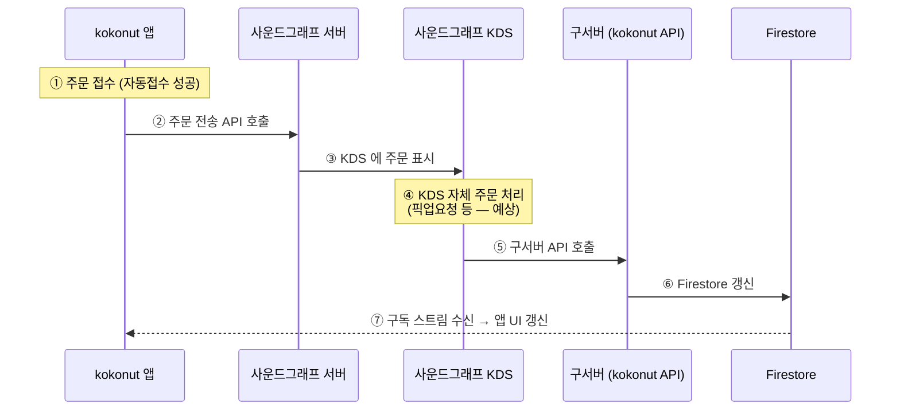
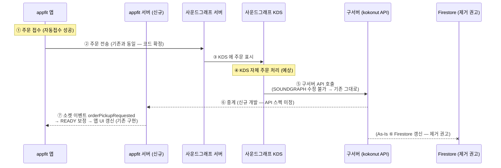

# 사운드그래프 연동 흐름 (매머드 전용: MMTH/MHST)

매머드커피(MMTH 운영·MHST 스테이징) 매장의 주문을 사운드그래프 KDS 로 전송하는 연동 흐름 도식.
As-Is(kokonut 앱, 왕복 경로 존재)와 To-Be(appfit 앱, 구서버 중계안)를 대비한다. (작성: 2026-07-14)

운영중 매장: 신사압구정점, 송파둘레길본점

**표기 규약**: 실선 = 코드로 확인된 기존 동작 / 점선·`(예상)`·`(미정)` = 신규 개발 필요 또는 코드 밖 추정.

- hook 게이팅: `lib/services/soundgraph_hook.dart:42-60`
- 전송 대상: `https://youframe-manager-mmth.appspot.com` (Bearer 인증, `lib/services/soundgraph_service.dart`)

## 1. As-Is — kokonut 앱 (왕복 경로 존재)

kokonut 앱은 사운드그래프 KDS 의 처리 결과가 **구서버 → Firestore** 를 거쳐 앱으로 되돌아오는 왕복 구조. (④~⑦은 타 repo·외부 시스템 동작으로, 본 repo 코드 밖)

## 2. To-Be — appfit 앱 (구서버 중계안)

appfit 앱은 현재 **송신 전용**이다: `cloud_firestore` 의존성은 있으나 import 0건 — Firestore 수신 코드 없음(⑤~⑦ 리턴 경로 부재). 사운드그래프 측은 수정 개발이 불가하여 ⑤(SOUNDGRAPH→구서버 호출)는 그대로 유지되므로, **구서버가 appfit 서버로 중계**하는 레그가 신규로 필요하다. 중계만 되면 앱의 기존 소켓 수신(`orderPickupRequested` → READY 보정, `lib/providers/order/order_socket_manager.dart:441-454`)으로 UI 갱신이 이어진다.

### 의견 — Firestore 갱신·구독 레그 제거 권고

As-Is 에는 없던 "주문 상태 변경마다 소켓 이벤트 수신"이 To-Be(appfit 백엔드)에는 이미 존재한다. 리턴 경로를 **소켓으로 일원화**하고 Firestore 갱신(구서버)·구독(앱) 레그는 제거하는 것이 좋다:

- appfit 앱에는 Firestore 수신 코드가 애초에 없음 → 앱 측 신규 개발 없이 기존 소켓 경로 재사용.
- 동일 상태 변경이 Firestore 와 소켓 양쪽으로 전달되면 이중 소스 충돌(순서 역전·중복 갱신) 관리 비용만 늘어남.
- Firestore 프로젝트(`orderkds-ab33b`) 의존 축소.

## 5. 전송 payload 요약

`OrderModel.toJsonForSoundGraph(marketId, brandId:)` (`lib/models/order_model.dart:279`)

| 필드 | 값 |
|---|---|
| `brandId` | `'mmth'` 고정 (hook 이 주입 — 모델은 브랜드 무관) |
| `marketId` | 설정에서 등록한 값 |
| `orderChannel` | paymentCode 에 `KIOSK` 포함 시 1, 아니면 2 |
| `vibBell` | displayNum 파싱 정수 (진동벨 번호) |
| `orderId` | `orderNo` |
| `orders` | 메뉴 목록 (`order_menu_model.dart:92`, 옵션 포함). 항목별 `skuNo`/`optSku` 는 `itemPosId`(POS 상품코드) 우선, 없으면 `shopItemId`/`shopOptionId` 폴백 |
| `kioskId` | `kioskId` |

## 6. 미정 / 확인 필요

- **구서버 → appfit 서버 중계 API 스펙** (엔드포인트·인증·payload 매핑·상태 전이 규칙) — 신규 설계 필요.
- SOUNDGRAPH → 구서버 콜백의 정확한 payload/이벤트 종류 — 본 repo 코드 밖 (구서버 코드·SOUNDGRAPH 문서로 확인).
- appfit 서버가 중계 수신 시 발행할 소켓 이벤트 매핑 (예: 픽업요청 → `orderPickupRequested`/2009 READY) 확정.
- kokonut Firestore 경로 세부 — 타 repo (kokonut C4 모델 참고).
